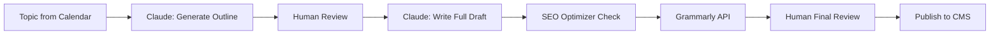

# Content Marketing Automation System
## Claude AI-Powered Marketing Engine for Solo Developers

> **Status**: Production-Ready Blueprint
> **Target**: Solo Developers, Indie Hackers, Small Teams
> **Stack**: Claude API, n8n, GitHub Actions, Analytics APIs
> **ROI**: 80% time savings, 10x content output

---

## System Architecture

```
┌─────────────────────────────────────────────────────────────┐
│                    CONTENT STRATEGY ENGINE                   │
│  Keyword Research → Topic Clustering → Content Calendar     │
└─────────────────┬───────────────────────────────────────────┘
                  │
┌─────────────────▼───────────────────────────────────────────┐
│              CLAUDE PROJECTS (4 Specialized)                 │
│  ┌──────────┐ ┌──────────┐ ┌──────────┐ ┌──────────┐      │
│  │Blog Writer│ │Social    │ │Newsletter│ │SEO       │      │
│  │Project    │ │Media     │ │Project   │ │Optimizer │      │
│  └──────────┘ └──────────┘ └──────────┘ └──────────┘      │
└─────────────────┬───────────────────────────────────────────┘
                  │
┌─────────────────▼───────────────────────────────────────────┐
│              GENERATION PIPELINE (n8n)                       │
│  Draft → Review → Optimize → Publish → Track                │
└─────────────────┬───────────────────────────────────────────┘
                  │
┌─────────────────▼───────────────────────────────────────────┐
│         MULTI-CHANNEL DISTRIBUTION                           │
│  Blog • LinkedIn • Twitter • Email • YouTube Scripts         │
└──────────────────────────────────────────────────────────────┘
```

---

## 1. Content Strategy Engine

### 1.1 Keyword Research Automation

**Tools**: Claude API + DataForSEO API / Google Trends API

**Workflow**:
```typescript
// Automated keyword research pipeline
{
  "trigger": "weekly_schedule",
  "steps": [
    {
      "name": "fetch_seed_keywords",
      "source": "Google Search Console API",
      "params": { "top_queries": 50 }
    },
    {
      "name": "expand_keywords",
      "ai_provider": "claude",
      "prompt": "Generate 20 long-tail keyword variations for: {seed_keyword}",
      "context": {
        "niche": "SaaS development",
        "target_audience": "indie hackers",
        "content_type": "technical blog"
      }
    },
    {
      "name": "analyze_competition",
      "method": "serp_analysis",
      "metrics": ["domain_authority", "content_depth", "backlinks"]
    },
    {
      "name": "score_keywords",
      "formula": "(search_volume * 0.3) + (keyword_difficulty_inverse * 0.4) + (relevance * 0.3)"
    }
  ],
  "output": "notion_database"
}
```

**Key Features**:
- **Auto-Discovery**: Scrapes competitor blogs, Reddit, Hacker News
- **Trend Detection**: Google Trends + Twitter trending topics
- **Difficulty Scoring**: Ahrefs API / SEMrush API integration
- **Opportunity Finder**: Identifies low-competition, high-intent keywords

### 1.2 Topic Clustering

**Claude Prompt Template**:
```
You are a content strategist. Analyze these 50 keywords and create 5-7 content clusters.

KEYWORDS:
{keyword_list}

For each cluster:
1. Core topic (1-3 words)
2. Pillar content title (H1)
3. Supporting article titles (5-10)
4. Internal linking strategy
5. Target keyword for each piece

Output as JSON.
```

**Algorithm**:
```python
# Semantic clustering using Claude
def create_topic_clusters(keywords):
    # Step 1: Generate embeddings via Claude
    embeddings = claude_api.embed(keywords)

    # Step 2: K-means clustering
    clusters = kmeans(embeddings, n_clusters=7)

    # Step 3: Claude analyzes each cluster
    for cluster in clusters:
        analysis = claude_api.complete({
            "model": "claude-opus-4-5",
            "prompt": f"""Analyze this keyword cluster and suggest:
            1. Pillar page topic
            2. 8 supporting articles
            3. Content types (guide, tutorial, comparison)

            Keywords: {cluster.keywords}"""
        })

    return analysis
```

### 1.3 Content Calendar Generation

**Features**:
- **Smart Scheduling**: Publishes Tuesday/Thursday (optimal engagement)
- **Seasonal Trends**: Holiday content auto-scheduled 4 weeks ahead
- **Repurposing**: Auto-converts blog → Twitter thread → LinkedIn carousel
- **Balance**: 60% educational, 30% promotional, 10% personal

**Notion Database Schema**:
```json
{
  "Content Calendar": {
    "properties": {
      "Title": "text",
      "Status": "select", // Idea, Outline, Draft, Review, Published
      "Publish Date": "date",
      "Primary Keyword": "text",
      "Content Type": "select", // Blog, Newsletter, Social, Video Script
      "Cluster": "relation",
      "SEO Score": "number",
      "Engagement (est.)": "number",
      "Distribution Channels": "multi_select"
    }
  }
}
```

### 1.4 Competitor Content Analysis

**n8n Workflow**:
```json
{
  "name": "Competitor Content Scraper",
  "nodes": [
    {
      "type": "Schedule Trigger",
      "cron": "0 9 * * 1" // Every Monday 9am
    },
    {
      "type": "HTTP Request",
      "url": "{competitor_rss_feed}",
      "method": "GET"
    },
    {
      "type": "Claude AI",
      "prompt": "Analyze this competitor article. Extract: 1) Core angle, 2) Unique insights, 3) Gaps we can fill, 4) Better headline ideas. Article: {article_content}"
    },
    {
      "type": "Notion",
      "operation": "create",
      "database": "Competitor Insights"
    }
  ]
}
```

---

## 2. Content Generation Pipeline

### 2.1 Blog Posts (SEO Optimized)

**Claude Project: Blog Writer**

**Custom Instructions** (see: `claude-projects/blog-writer.md`):
```markdown
# Role
You are an expert technical blog writer for indie hackers and developers.

# Style Guide
- Tone: Conversational, helpful, no corporate jargon
- Structure: AIDA (Attention, Interest, Desire, Action)
- Length: 1500-2500 words
- Reading Level: Grade 8-10 (Hemingway Editor)
- Code Examples: Always include working snippets

# SEO Requirements
- Primary keyword in: H1, first paragraph, 1 H2, meta description
- Keyword density: 1-2%
- Internal links: 3-5 to related posts
- External links: 2-3 to authoritative sources
- Images: Alt text with keywords

# Output Format
```
# {SEO_OPTIMIZED_TITLE}

**Meta Description**: {150 chars with primary keyword}

{Hook paragraph with primary keyword}

## Table of Contents
- [Section 1]
- [Section 2]
...

{Body with H2/H3 structure}

## Conclusion
{Summary + CTA}

---
**Primary Keyword**: {keyword}
**Secondary Keywords**: {keyword1, keyword2}
**Word Count**: {count}
**Readability Score**: {score}
```
```

**Generation Workflow**:


### 2.2 LinkedIn Posts

**Claude Project: Social Media**

**Templates** (5 viral formats):

1. **Listicle**:
```
{Number} {topic} I wish I knew as a {role}:

1. {insight}
   → {actionable tip}

2. {insight}
   → {actionable tip}

...

{Number}. {insight}
   → {actionable tip}

Which one resonates with you?

#tech #development #productivity
```

2. **Storytelling**:
```
{Year} ago, I {struggled with X}.

Today, I {achieved Y}.

Here's what changed:

{Story in 3-5 short paragraphs}

Lesson: {takeaway}

Have you faced something similar?
```

3. **Controversial Take**:
```
Unpopular opinion:

{Bold statement that challenges conventional wisdom}

Why?

• {Reason 1}
• {Reason 2}
• {Reason 3}

Agree or disagree? Let's discuss 👇
```

4. **Tutorial**:
```
How to {achieve outcome} in {timeframe}:

Step 1: {action}
↳ {why it matters}

Step 2: {action}
↳ {why it matters}

...

Bookmark this for later 🔖

#tutorial #howto
```

5. **Data-Driven**:
```
I analyzed {number} {thing}:

Here's what I found:

📊 {Stat 1}
📊 {Stat 2}
📊 {Stat 3}

Surprising insight: {takeaway}

Full breakdown in comments 👇
```

### 2.3 Twitter/X Threads

**Thread Generator Prompt**:
```
Convert this blog post into a 10-tweet thread for X (Twitter).

BLOG TITLE: {title}
CORE TAKEAWAYS: {key_points}

REQUIREMENTS:
1. Tweet 1: Hook (curiosity gap or bold claim)
2. Tweets 2-8: Core content (1 idea per tweet)
3. Tweet 9: Summary
4. Tweet 10: CTA (follow me, read blog)

Each tweet:
- Max 280 characters
- 1 line break for readability
- 1-2 emojis max
- No hashtags (except last tweet)

Make it:
- Skimmable
- Quotable
- Shareable
```

### 2.4 Email Newsletters

**Claude Project: Newsletter**

**Template** (Weekly Dev Newsletter):
```markdown
Subject: [{Emoji}] {Curiosity-driven subject line}

---

Hey {first_name},

{Personal intro - 1 sentence}

This week, I {what you learned/built/discovered}.

## 📚 What I'm Reading
{1 curated article with takeaway}

## 🛠️ Tool of the Week
{1 tool with use case}

## 💡 Quick Tip
{1 actionable tip, 50 words}

## 🔗 Link Roundup
- {Link 1 with context}
- {Link 2 with context}
- {Link 3 with context}

---

**P.S.** {Personal note or sneak peek of next week}

[Unsubscribe](link)
```

**Automation**:
- **Source**: Notion database → Filter by "Newsletter" tag
- **Schedule**: Every Friday 8am
- **Personalization**: ConvertKit/Mailchimp dynamic fields
- **A/B Testing**: Auto-test 2 subject lines

### 2.5 Case Studies

**Structure** (SaaS Case Study Template):
```markdown
# How {Company} {Achieved Result} with {Your Solution}

## The Challenge
{Customer's pain point in their words}

**Key Metrics Before:**
- {Metric 1}: {Value}
- {Metric 2}: {Value}

## The Solution
{What they implemented}

{Screenshot/video embed}

## The Results
**After {Timeframe}:**
- ✅ {Metric 1}: {Value} → {Improved Value} ({X}% increase)
- ✅ {Metric 2}: {Value} → {Improved Value} ({X}% increase)

"{Customer testimonial quote}"
— {Name}, {Title} at {Company}

## How You Can Replicate This
{3-step action plan}

[CTA: Get Started Free]
```

---

## 3. Claude Projects Setup

### Project 1: Blog Writer

**File**: `claude-projects/blog-writer.md`

```markdown
# Blog Writer Project - Custom Instructions

## Your Role
Expert technical content writer specializing in SaaS, development, and productivity content for indie hackers.

## Writing Style
- **Tone**: Conversational, helpful, authentic (like Paul Graham or Pieter Levels)
- **Structure**: Scannable (short paragraphs, bullet points, subheadings)
- **Voice**: Second person ("you"), active voice
- **Humor**: Light, self-deprecating (no forced jokes)

## SEO Rules (Non-Negotiable)
1. Primary keyword in:
   - H1 title
   - First 100 words
   - At least 1 H2
   - Meta description
   - URL slug
2. Keyword density: 1-2% (natural)
3. Internal links: 3-5 contextual
4. External links: 2-3 authoritative
5. Alt text: All images

## Content Structure
```
# {Title with Primary Keyword}

{Hook: Problem or curiosity gap - 50 words}

{Optional: TOC for 2000+ word posts}

## {H2 Section 1}
{Content with examples}

## {H2 Section 2}
{Content with examples}

...

## Conclusion
{Summary + CTA}
```

## Research Process
1. Search top 5 ranking articles for keyword
2. Identify coverage gaps
3. Find 1-2 unique angles
4. Include personal experience or data

## Quality Checklist
- [ ] Passes Hemingway Editor (Grade 8-10)
- [ ] Grammarly score: 90+
- [ ] Word count: 1500-2500
- [ ] Code examples: Syntax highlighted, working
- [ ] Images: Optimized (<200KB), alt text
- [ ] CTA: Clear, single action

## Knowledge Files
- brand_voice.md
- seo_keyword_database.csv
- competitor_analysis.md
- internal_link_map.json
```

### Project 2: Social Media Manager

**File**: `claude-projects/social-media.md`

```markdown
# Social Media Manager Project

## Platforms & Specs
### LinkedIn
- **Optimal Length**: 1200-1500 characters
- **Best Times**: Tue-Thu, 8am-10am EST
- **Format**: Text-only (higher reach than link posts)
- **Hashtags**: 3-5 relevant

### Twitter/X
- **Thread Length**: 8-12 tweets
- **Tweet 1**: Hook (no context, pure curiosity)
- **Best Times**: Mon-Fri, 9am-12pm EST
- **Hashtags**: 0-1 per tweet

### Reddit
- **Tone**: Ultra-casual, community-first
- **Self-Promotion**: Max 10% of posts
- **Format**: Long-form text, helpful
- **Subreddits**: r/SaaS, r/Entrepreneur, r/webdev

## Content Pillars (20% each)
1. **Educational**: How-tos, tutorials
2. **Inspirational**: Success stories, lessons
3. **Promotional**: Product updates, case studies
4. **Engagement**: Polls, questions, discussions
5. **Personal**: Behind-the-scenes, journey

## Viral Formulas
### LinkedIn
- "I {past struggle} → Now I {achievement}. Here's how:"
- "{Number} lessons from {experience}:"
- "Unpopular opinion: {controversial take}"

### Twitter
- "If I could restart my {journey}, I'd do these {number} things:"
- "Here's a {thing} I built in {timeframe}. Thread 🧵"
- "Everyone tells you to {common advice}. I did the opposite. Here's what happened:"

## Repurposing Matrix
| Source | LinkedIn | Twitter | Reddit | Newsletter |
|--------|----------|---------|--------|------------|
| Blog Post | Key takeaways + link | 10-tweet thread | Expanded guide | Excerpt + CTA |
| Video | Transcript + embed | Quote tweets | Timestamped | Behind-the-scenes |
| Case Study | Results graphic | Stats thread | AMA format | Customer spotlight |

## Knowledge Files
- content_calendar.csv
- viral_post_swipe_file.md
- brand_hashtags.txt
```

### Project 3: Email Newsletter

**File**: `claude-projects/newsletter.md`

```markdown
# Email Newsletter Project

## Newsletter Types
### 1. Weekly Digest (Fridays)
- Curated links: 5-7
- Original tip: 1
- Personal update: 1
- Length: 300-500 words

### 2. Deep Dive (Monthly)
- Original long-form: 1500 words
- Research-backed
- Actionable steps
- Length: 1500-2000 words

### 3. Product Announcements
- What's new: 1-2 features
- Why it matters: Customer benefit
- How to use: Step-by-step
- Length: 200-400 words

## Subject Line Formulas
1. **Curiosity**: "The {tool/method} I can't stop using"
2. **FOMO**: "You're missing out on {benefit}"
3. **Urgency**: "{X} hours left to {action}"
4. **Personalization**: "{Name}, your {thing} is waiting"
5. **Question**: "Still {struggling with X}?"

## Email Structure
```
Subject: {Curiosity-driven headline}
Preview Text: {Extend the curiosity}

---

{Personalization token}

{Hook - 1 sentence problem}

{Body - 3-5 short sections}

{CTA - Single, clear action}

---

P.S. {Personal note}
```

## A/B Testing Queue
Test every send:
- Subject line (2 variants)
- CTA placement (top vs. bottom)
- Preview text (curiosity vs. benefit)

## Metrics to Track
- Open rate: >30% (target)
- Click rate: >5% (target)
- Unsubscribe: <0.5%
- Reply rate: >1%

## Segmentation Strategy
1. **Engaged**: Opened 3+ emails in 30 days → Deep dives
2. **Lurkers**: Opened <3 in 30 days → Re-engagement
3. **New**: Joined <30 days ago → Welcome series
4. **Power Users**: Clicked 5+ links → Product updates

## Knowledge Files
- email_templates.html
- subject_line_swipe_file.txt
- segment_definitions.json
```

### Project 4: SEO Optimizer

**File**: `claude-projects/seo-optimizer.md`

```markdown
# SEO Optimizer Project

## Your Mission
Analyze content and provide actionable SEO improvements to rank on page 1.

## Optimization Checklist

### 1. Keyword Optimization
- [ ] Primary keyword in H1 (exact match)
- [ ] Primary keyword in first 100 words
- [ ] Primary keyword in URL slug
- [ ] Secondary keywords in H2s
- [ ] LSI keywords naturally distributed
- [ ] Keyword density: 1-2%

### 2. Content Structure
- [ ] H1: 1 only
- [ ] H2: 3-7 (logical flow)
- [ ] H3: Supporting points
- [ ] Paragraphs: Max 3-4 sentences
- [ ] Bullet points: Break up text
- [ ] Table of Contents: For 2000+ words

### 3. Meta Data
- [ ] Title tag: 50-60 characters
- [ ] Meta description: 150-160 characters
- [ ] Primary keyword in both
- [ ] Compelling CTA in description

### 4. Internal Linking
- [ ] 3-5 contextual links
- [ ] Anchor text: Descriptive (not "click here")
- [ ] Links to: Related posts, pillar pages, conversion pages

### 5. External Linking
- [ ] 2-3 authoritative sources
- [ ] Domain Authority: 60+
- [ ] Open in new tab
- [ ] Rel="noopener noreferrer"

### 6. Images
- [ ] File names: keyword-descriptive.jpg
- [ ] Alt text: Descriptive with keyword
- [ ] Size: <200KB (WebP format)
- [ ] Lazy loading enabled

### 7. Readability
- [ ] Flesch Reading Ease: 60-70
- [ ] Grade Level: 8-10
- [ ] Sentence length: Avg 15-20 words
- [ ] Passive voice: <10%

### 8. Schema Markup
- [ ] Article schema
- [ ] FAQ schema (if applicable)
- [ ] HowTo schema (for tutorials)
- [ ] BreadcrumbList schema

## Analysis Output Format
```markdown
# SEO Audit: {Article Title}

## Overall Score: {X}/100

### 🟢 Strengths
- {What's working well}

### 🔴 Critical Issues
1. {Issue}: {Impact} → {Fix}
2. {Issue}: {Impact} → {Fix}

### 🟡 Improvements
1. {Suggestion}: {Why} → {How}
2. {Suggestion}: {Why} → {How}

### Optimized Meta Data
**Title Tag** (55 chars): {optimized_title}
**Meta Description** (158 chars): {optimized_description}
**URL Slug**: /{optimized-slug}

### Keyword Strategy
- **Primary**: {keyword} (Volume: X, Difficulty: Y)
- **Secondary**: {keyword1}, {keyword2}
- **LSI**: {keyword3}, {keyword4}, {keyword5}

### Content Gaps (vs. Top 5 Competitors)
1. Missing: {Topic/Angle}
2. Shallow coverage: {Section}
3. Opportunity: {Unique angle}

### Schema Markup (JSON-LD)
```json
{schema_code}
```

## Competitor SERP Analysis
| Rank | URL | Word Count | Backlinks | Unique Angle |
|------|-----|------------|-----------|--------------|
| 1 | {url} | {count} | {count} | {angle} |
| 2 | {url} | {count} | {count} | {angle} |
...
```
```

## Knowledge Files
- seo_keyword_database.csv
- competitor_top_pages.json
- internal_link_opportunities.csv
- schema_templates.json
```

---

## 4. Publishing Automation

### 4.1 Draft → Review → Publish Workflow

**n8n Workflow**: `workflows/content-pipeline.json`

```json
{
  "name": "Content Publishing Pipeline",
  "nodes": [
    {
      "id": "1",
      "type": "Notion Trigger",
      "parameters": {
        "database_id": "{{CONTENT_CALENDAR_DB}}",
        "filter": {
          "property": "Status",
          "select": {
            "equals": "Ready for Review"
          }
        }
      }
    },
    {
      "id": "2",
      "type": "Claude AI",
      "parameters": {
        "project": "SEO Optimizer",
        "prompt": "Audit this article for SEO:\n\n{{$json.Content}}",
        "model": "claude-opus-4-5"
      }
    },
    {
      "id": "3",
      "type": "Grammarly API",
      "parameters": {
        "text": "{{$json.Content}}",
        "goal": "inform",
        "audience": "expert",
        "formality": "neutral"
      }
    },
    {
      "id": "4",
      "type": "IF",
      "parameters": {
        "conditions": {
          "and": [
            {"seo_score": {">=": 80}},
            {"grammarly_score": {">=": 90}}
          ]
        }
      }
    },
    {
      "id": "5",
      "type": "Slack",
      "parameters": {
        "channel": "#content-review",
        "message": "✅ Article ready: {{$json.Title}}\nSEO: {{$json.seo_score}}\nGrammar: {{$json.grammarly_score}}\n\n[Review Link]({{$json.NotionURL}})"
      }
    },
    {
      "id": "6",
      "type": "Wait for Webhook",
      "parameters": {
        "webhook_url": "{{APPROVAL_WEBHOOK}}",
        "timeout": 86400
      }
    },
    {
      "id": "7",
      "type": "WordPress",
      "parameters": {
        "operation": "create_post",
        "title": "{{$json.Title}}",
        "content": "{{$json.Content}}",
        "status": "publish",
        "meta": {
          "description": "{{$json.MetaDescription}}",
          "keywords": "{{$json.Keywords}}"
        }
      }
    },
    {
      "id": "8",
      "type": "Function",
      "parameters": {
        "code": "// Generate social snippets\nconst title = $json.Title;\nconst url = $json.PublishedURL;\n\nreturn {\n  linkedin: `New post: ${title}\\n\\n{excerpt}\\n\\nRead more: ${url}`,\n  twitter: `📝 ${title}\\n\\n{key_takeaway}\\n\\n${url}`,\n  email: `Subject: ${title}\\n\\n{preview_text}`\n};"
      }
    },
    {
      "id": "9",
      "type": "Buffer",
      "parameters": {
        "profile_id": "{{LINKEDIN_PROFILE}}",
        "text": "{{$json.linkedin}}",
        "scheduled_at": "{{$now.plus(1, 'hours')}}"
      }
    },
    {
      "id": "10",
      "type": "Twitter API v2",
      "parameters": {
        "operation": "create_thread",
        "tweets": "{{$json.twitter_thread}}"
      }
    }
  ],
  "connections": [
    {"from": "1", "to": "2"},
    {"from": "2", "to": "3"},
    {"from": "3", "to": "4"},
    {"from": "4:true", "to": "5"},
    {"from": "5", "to": "6"},
    {"from": "6:approved", "to": "7"},
    {"from": "7", "to": "8"},
    {"from": "8", "to": ["9", "10"]}
  ]
}
```

### 4.2 Multi-Platform Distribution

**Distribution Matrix**:

| Content Type | Blog | LinkedIn | Twitter | Email | Reddit |
|--------------|------|----------|---------|-------|--------|
| Tutorial | ✅ Full | 📝 Key steps | 🧵 Thread | 📧 Excerpt | ✅ Full (r/webdev) |
| Case Study | ✅ Full | 📊 Results graphic | 🧵 Stats thread | 📧 Summary | ❌ |
| Opinion | ✅ Full | 💬 Full text | 🧵 Thread | ❌ | ✅ Discussion |
| Tool Review | ✅ Full | ⭐ Pros/Cons | 🧵 Quick tips | 📧 Affiliate link | ✅ Honest review |

**Auto-Scheduling Rules**:
```javascript
const scheduleRules = {
  blog: {
    days: ['Tuesday', 'Thursday'],
    time: '09:00',
    timezone: 'America/New_York'
  },
  linkedin: {
    days: ['Monday', 'Wednesday', 'Friday'],
    time: '08:30',
    avoid: ['holidays', 'weekends']
  },
  twitter: {
    frequency: 'daily',
    times: ['09:00', '13:00', '17:00'],
    threadDay: 'Thursday'
  },
  email: {
    day: 'Friday',
    time: '08:00',
    segment: 'engaged_subscribers'
  }
};
```

### 4.3 Image Generation Integration

**DALL-E 3 Prompt Templates**:

```javascript
const imagePrompts = {
  blogHero: `Create a modern, minimalist hero image for a tech blog post titled "{title}".
             Style: Flat design, gradient background ({brand_color_1} to {brand_color_2}),
             geometric shapes, no text. Aspect ratio: 16:9. High contrast.`,

  socialGraphic: `Design a social media graphic for LinkedIn/Twitter.
                  Main text: "{key_quote}"
                  Style: Bold typography, {brand_color} accent, white background,
                  subtle pattern. Include logo placeholder. Size: 1200x630px.`,

  infographic: `Create an infographic showing "{data_visualization_description}".
                Style: Clean, data-focused, {brand_color} highlights,
                icon-based, numbered steps. Vertical layout.`,

  thumbnail: `YouTube thumbnail for "{video_title}".
              Style: High contrast, dramatic lighting, bold text overlay area,
              tech aesthetic. Vibrant but professional. 1280x720px.`
};

// n8n Integration
{
  "type": "OpenAI DALL-E 3",
  "parameters": {
    "prompt": "{{imagePrompts.blogHero}}",
    "size": "1792x1024",
    "quality": "hd"
  },
  "post_processing": {
    "compress": true,
    "format": "webp",
    "max_size": "200kb"
  }
}
```

### 4.4 Video Script Generation

**YouTube Script Template**:

```markdown
# Video Script: {Title}

**Duration**: {X} minutes
**Target Audience**: {audience}
**Goal**: {objective}

---

## HOOK (0:00-0:15)
{Attention-grabbing question or statement}

**Visual**: {B-roll suggestion}

---

## INTRO (0:15-0:30)
"Hey everyone, {name} here. In today's video, I'm going to show you {promise}."

**Visual**: {Screen recording or talking head}

---

## MAIN CONTENT

### Section 1: {Topic} (0:30-2:00)
**Script**:
{Explanation with examples}

**Visual**:
- 0:30: {Screen capture of X}
- 1:00: {Code walkthrough}
- 1:30: {Diagram overlay}

**B-Roll**:
- {Typing code}
- {Terminal output}

---

### Section 2: {Topic} (2:00-4:00)
{Repeat structure}

---

## CONCLUSION (4:00-4:30)
"So to recap: {key_takeaway_1}, {key_takeaway_2}, {key_takeaway_3}."

**CTA**:
"If this was helpful, like and subscribe. Link to the full tutorial is in the description."

---

## DESCRIPTION

{Video description with timestamps, links, and CTAs}

---

## TIMESTAMPS
0:00 Intro
0:30 {Section 1}
2:00 {Section 2}
4:00 Conclusion
```

**Claude Prompt for Script Generation**:
```
Convert this blog post into a 5-minute YouTube script.

BLOG: {blog_content}

Requirements:
1. Hook in first 15 seconds (curiosity or pain point)
2. Promise clear outcome
3. Break into 3-4 sections (90-120 sec each)
4. Include screen recording cues
5. Natural, conversational tone (not scripted)
6. End with clear CTA

Include:
- Visual suggestions for each section
- B-roll ideas
- On-screen text cues
- Timestamp markers
```

---

## 5. SEO Automation

### 5.1 On-Page Optimization

**Auto-Optimizer Script** (GitHub Action):

```yaml
# .github/workflows/seo-optimizer.yml
name: SEO Auto-Optimizer

on:
  push:
    paths:
      - 'content/posts/**/*.md'

jobs:
  optimize:
    runs-on: ubuntu-latest
    steps:
      - uses: actions/checkout@v3

      - name: Extract metadata
        id: meta
        run: |
          POST_PATH="${{ github.event.commits[0].modified[0] }}"
          TITLE=$(grep '^# ' "$POST_PATH" | sed 's/# //')
          echo "title=$TITLE" >> $GITHUB_OUTPUT

      - name: Claude SEO Analysis
        id: claude
        run: |
          curl -X POST https://api.anthropic.com/v1/messages \
            -H "x-api-key: ${{ secrets.CLAUDE_API_KEY }}" \
            -H "anthropic-version: 2023-06-01" \
            -d '{
              "model": "claude-opus-4-5",
              "messages": [{
                "role": "user",
                "content": "Optimize this post for SEO: $(cat $POST_PATH)"
              }],
              "max_tokens": 4096
            }'

      - name: Apply optimizations
        run: |
          # Auto-add meta description
          # Auto-add internal links
          # Auto-optimize headings
          # Auto-generate alt text

      - name: Commit changes
        run: |
          git config user.name "SEO Bot"
          git commit -am "🔍 SEO optimization"
          git push
```

### 5.2 Internal Linking Suggestions

**Smart Linker Algorithm**:

```python
# internal-linker.py
import anthropic
import json

def suggest_internal_links(new_post_content, existing_posts):
    """
    Uses Claude to suggest contextual internal links
    """
    client = anthropic.Anthropic(api_key=os.environ["CLAUDE_API_KEY"])

    prompt = f"""
    Analyze this new blog post and suggest internal links.

    NEW POST:
    {new_post_content}

    EXISTING POSTS:
    {json.dumps(existing_posts, indent=2)}

    For each suggested link:
    1. Find the exact phrase in the new post to link
    2. Match it to the most relevant existing post
    3. Explain why it's a good fit

    Output as JSON:
    [
      {{
        "anchor_text": "phrase to link",
        "target_url": "/existing-post-slug",
        "reason": "why relevant",
        "priority": "high|medium|low"
      }}
    ]
    """

    response = client.messages.create(
        model="claude-opus-4-5",
        max_tokens=2048,
        messages=[{"role": "user", "content": prompt}]
    )

    return json.loads(response.content[0].text)

# Usage in CI/CD
suggestions = suggest_internal_links(new_post, get_all_posts())
apply_links(new_post, suggestions, min_priority="medium")
```

### 5.3 Meta Description Generation

**Auto-Generator**:

```javascript
// meta-generator.js
const Anthropic = require('@anthropic-ai/sdk');

async function generateMetaDescription(title, content) {
  const client = new Anthropic({
    apiKey: process.env.CLAUDE_API_KEY
  });

  const prompt = `
    Create an SEO-optimized meta description for this article.

    TITLE: ${title}
    CONTENT: ${content.substring(0, 2000)}

    Requirements:
    - Exactly 150-160 characters
    - Include primary keyword naturally
    - Compelling CTA or benefit
    - No clickbait

    Output ONLY the meta description, no explanation.
  `;

  const message = await client.messages.create({
    model: 'claude-sonnet-4-5',
    max_tokens: 256,
    messages: [{ role: 'user', content: prompt }]
  });

  return message.content[0].text.trim();
}

// Auto-inject into frontmatter
const metaDesc = await generateMetaDescription(post.title, post.content);
post.frontmatter.description = metaDesc;
```

### 5.4 Schema Markup

**Auto-Generated Schema** (Article + FAQ):

```javascript
// schema-generator.js
function generateArticleSchema(post) {
  return {
    "@context": "https://schema.org",
    "@type": "BlogPosting",
    "headline": post.title,
    "description": post.meta_description,
    "image": post.featured_image,
    "author": {
      "@type": "Person",
      "name": post.author.name,
      "url": post.author.url
    },
    "publisher": {
      "@type": "Organization",
      "name": "Your Brand",
      "logo": {
        "@type": "ImageObject",
        "url": "https://yourdomain.com/logo.png"
      }
    },
    "datePublished": post.published_at,
    "dateModified": post.updated_at,
    "mainEntityOfPage": {
      "@type": "WebPage",
      "@id": post.url
    }
  };
}

// FAQ Schema (Claude extracts Q&A)
async function generateFAQSchema(content) {
  const faqs = await claudeExtractFAQs(content);

  return {
    "@context": "https://schema.org",
    "@type": "FAQPage",
    "mainEntity": faqs.map(faq => ({
      "@type": "Question",
      "name": faq.question,
      "acceptedAnswer": {
        "@type": "Answer",
        "text": faq.answer
      }
    }))
  };
}
```

---

## 6. Performance Tracking

### 6.1 Traffic Analytics

**Dashboard Schema** (Notion Database):

```json
{
  "Content Performance": {
    "properties": {
      "Title": "title",
      "URL": "url",
      "Publish Date": "date",
      "Channel": "select",
      "Views (7d)": "number",
      "Views (30d)": "number",
      "CTR": "number",
      "Avg. Time": "number",
      "Conversions": "number",
      "Revenue": "number",
      "ROI": "formula",
      "Status": "select" // 🔥 Viral, ✅ Good, 📉 Underperforming
    }
  }
}
```

**Auto-Sync Workflow** (n8n):

```json
{
  "name": "Analytics Sync",
  "schedule": "0 */6 * * *",
  "nodes": [
    {
      "type": "Google Analytics 4",
      "operation": "get_report",
      "dimensions": ["pagePath", "pageTitle"],
      "metrics": ["screenPageViews", "averageSessionDuration", "conversions"],
      "date_range": "last_7_days"
    },
    {
      "type": "Function",
      "code": "// Calculate performance score\nconst score = (views * 0.4) + (avgTime * 0.3) + (conversions * 0.3);\nreturn { ...item, performance_score: score };"
    },
    {
      "type": "Notion",
      "operation": "update_page",
      "match_property": "URL"
    }
  ]
}
```

### 6.2 Engagement Metrics

**Multi-Platform Tracker**:

```javascript
// engagement-tracker.js
const platforms = {
  linkedin: {
    api: 'LinkedIn Marketing API',
    metrics: ['impressions', 'clicks', 'likes', 'comments', 'shares'],
    endpoint: '/ugcPosts/{postId}/analytics'
  },
  twitter: {
    api: 'Twitter API v2',
    metrics: ['impressions', 'retweets', 'likes', 'replies', 'profile_clicks'],
    endpoint: '/tweets/:id/metrics'
  },
  email: {
    api: 'ConvertKit API',
    metrics: ['sent', 'opens', 'clicks', 'unsubscribes'],
    endpoint: '/broadcasts/:id/stats'
  }
};

async function fetchAllEngagement(content_id) {
  const results = {};

  for (const [platform, config] of Object.entries(platforms)) {
    const data = await fetch(`${config.endpoint}/${content_id}`);
    results[platform] = {
      ...data,
      engagement_rate: calculateEngagementRate(data, platform)
    };
  }

  return results;
}

function calculateEngagementRate(data, platform) {
  const formulas = {
    linkedin: (data.likes + data.comments + data.shares) / data.impressions,
    twitter: (data.retweets + data.likes + data.replies) / data.impressions,
    email: data.clicks / data.opens
  };

  return (formulas[platform] * 100).toFixed(2);
}
```

### 6.3 Conversion Tracking

**Attribution Model**:

```sql
-- conversion_attribution.sql
WITH content_touchpoints AS (
  SELECT
    user_id,
    content_url,
    timestamp,
    channel,
    ROW_NUMBER() OVER (PARTITION BY user_id ORDER BY timestamp) as touch_number
  FROM analytics_events
  WHERE event_type = 'page_view'
),
conversions AS (
  SELECT
    user_id,
    conversion_value,
    conversion_type,
    timestamp as conversion_time
  FROM conversion_events
)
SELECT
  ct.content_url,
  ct.channel,
  COUNT(DISTINCT c.user_id) as conversions,
  SUM(c.conversion_value) as revenue,
  -- First-touch attribution
  COUNT(DISTINCT CASE WHEN ct.touch_number = 1 THEN c.user_id END) as first_touch_conversions,
  -- Last-touch attribution
  COUNT(DISTINCT CASE WHEN ct.touch_number = (SELECT MAX(touch_number) FROM content_touchpoints ct2 WHERE ct2.user_id = ct.user_id) THEN c.user_id END) as last_touch_conversions
FROM content_touchpoints ct
JOIN conversions c ON ct.user_id = c.user_id
  AND ct.timestamp < c.conversion_time
GROUP BY ct.content_url, ct.channel
ORDER BY revenue DESC;
```

**n8n Conversion Tracker**:

```json
{
  "nodes": [
    {
      "type": "Webhook",
      "path": "/conversion",
      "method": "POST"
    },
    {
      "type": "Function",
      "code": "// Extract UTM parameters\nconst { user_id, conversion_value, utm_source, utm_medium, utm_campaign, utm_content } = $json;\nreturn { user_id, conversion_value, content_url: utm_content };"
    },
    {
      "type": "PostgreSQL",
      "operation": "insert",
      "table": "conversions"
    },
    {
      "type": "Notion",
      "operation": "update",
      "database": "Content Performance",
      "filter": { "URL": "{{$json.content_url}}" },
      "update": {
        "Conversions": "{{$json.conversions + 1}}",
        "Revenue": "{{$json.revenue + $json.conversion_value}}"
      }
    }
  ]
}
```

### 6.4 Content ROI Calculator

**ROI Formula**:

```javascript
// roi-calculator.js
function calculateContentROI(content) {
  // Costs
  const costs = {
    writing: content.word_count / 500 * 50, // $50 per 500 words
    editing: 25,
    design: content.has_custom_graphics ? 50 : 0,
    promotion: content.ad_spend || 0,
    tools: 10 // Proportional tool costs
  };

  const totalCost = Object.values(costs).reduce((a, b) => a + b, 0);

  // Revenue
  const revenue = {
    direct: content.conversions * content.avg_order_value,
    affiliate: content.affiliate_clicks * 0.05 * content.affiliate_commission,
    ads: content.pageviews * 0.01, // $10 RPM
    leads: content.email_signups * 5 // $5 per lead value
  };

  const totalRevenue = Object.values(revenue).reduce((a, b) => a + b, 0);

  // ROI Calculation
  const roi = ((totalRevenue - totalCost) / totalCost) * 100;

  return {
    total_cost: totalCost,
    total_revenue: totalRevenue,
    profit: totalRevenue - totalCost,
    roi_percentage: roi,
    payback_period_days: content.days_since_publish * (totalCost / totalRevenue),
    status: roi > 100 ? '🚀 Profitable' : roi > 0 ? '✅ Breakeven' : '📉 Loss'
  };
}

// Auto-update in Notion
async function updateContentROI(notion_page_id) {
  const content = await getContentMetrics(notion_page_id);
  const roi = calculateContentROI(content);

  await notion.pages.update({
    page_id: notion_page_id,
    properties: {
      'ROI (%)': { number: roi.roi_percentage },
      'Revenue': { number: roi.total_revenue },
      'Profit': { number: roi.profit },
      'Status': { select: { name: roi.status } }
    }
  });
}
```

---

## Implementation Roadmap

### Week 1: Foundation
- [ ] Set up Claude API account
- [ ] Create 4 Claude Projects
- [ ] Install n8n (self-hosted or cloud)
- [ ] Set up Notion workspace
- [ ] Connect analytics (GA4, GSC)

### Week 2: Content Strategy
- [ ] Build keyword research workflow
- [ ] Create topic clusters
- [ ] Generate 12-week content calendar
- [ ] Set up competitor monitoring

### Week 3: Generation Pipeline
- [ ] Configure blog writer workflow
- [ ] Set up social media repurposing
- [ ] Create email newsletter templates
- [ ] Test end-to-end pipeline

### Week 4: Automation & Optimization
- [ ] Implement SEO auto-optimizer
- [ ] Set up multi-platform publishing
- [ ] Configure analytics dashboards
- [ ] Launch first automated campaign

---

## Cost Breakdown (Monthly)

| Tool | Plan | Cost |
|------|------|------|
| Claude API | Pro (500K tokens/mo) | $18 |
| n8n | Cloud (10K executions) | $20 |
| Notion | Plus | $10 |
| Buffer/Hootsuite | Essential | $6 |
| ConvertKit | Creator | $9 |
| DataForSEO | Startup | $50 |
| Grammarly | Premium | $12 |
| DALL-E 3 Credits | 100 images | $10 |
| **Total** | | **$135/mo** |

**ROI**: If this system generates 1 client/month ($500+), ROI = 270%

---

## Success Metrics (90 Days)

| Metric | Baseline | Target | Actual |
|--------|----------|--------|--------|
| Blog Posts Published | 4/mo | 12/mo | __ |
| LinkedIn Posts | 8/mo | 20/mo | __ |
| Twitter Threads | 4/mo | 12/mo | __ |
| Newsletter Subscribers | 100 | 500 | __ |
| Organic Traffic | 1K/mo | 5K/mo | __ |
| Conversions | 2/mo | 10/mo | __ |
| Time Spent on Content | 40h/mo | 10h/mo | __ |

---

## Troubleshooting

### Common Issues

**1. Claude API Rate Limits**
- **Solution**: Implement exponential backoff, use caching
```javascript
const retry = async (fn, retries = 3) => {
  for (let i = 0; i < retries; i++) {
    try {
      return await fn();
    } catch (err) {
      if (err.status === 429) {
        await sleep(2 ** i * 1000);
      } else throw err;
    }
  }
};
```

**2. Low Engagement on Generated Content**
- **Solution**: Add human review step, A/B test headlines
- **Tip**: Never auto-publish without review for first 30 days

**3. SEO Not Improving**
- **Solution**: Focus on search intent, not just keywords
- **Action**: Use Claude to analyze top 3 results and identify gaps

**4. Inconsistent Brand Voice**
- **Solution**: Create detailed style guide in Claude Project knowledge
- **Include**: 10 example posts, tone guidelines, banned phrases

---

## Next Steps

1. **Clone this repo**: `git clone [repo-url]`
2. **Copy `.env.example`**: Add your API keys
3. **Import n8n workflows**: `n8n import workflows/`
4. **Run setup script**: `npm run setup`
5. **Generate first content**: `npm run content:generate`

Happy automating! 🚀
