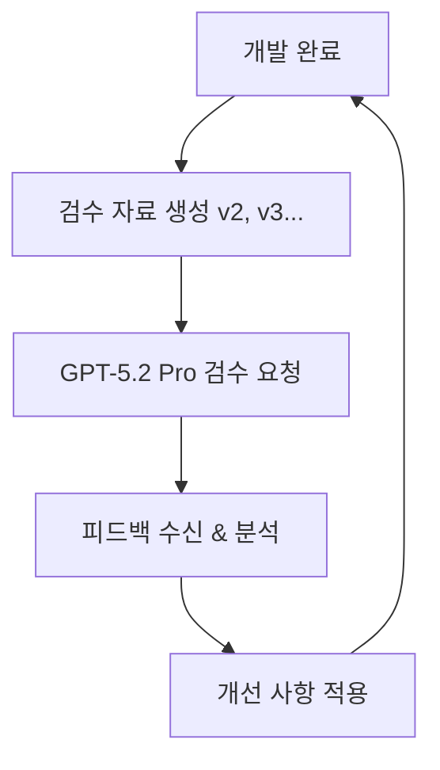

# 🔄 GPT-5.2 Pro 검수 사이클 워크플로우

> **목적**: 개발 → 검수 → 피드백 → 개선의 지속적 품질 향상 사이클

---

## 📊 워크플로우 단계



---

## 1️⃣ 개발 완료 시

### 자동 실행 체크리스트
- [ ] 최신 코드 변경사항 확인
- [ ] 새로운 기능 목록 작성
- [ ] 기술 스택 변경사항 문서화
- [ ] 성능 지표 측정 (있는 경우)

---

## 2️⃣ 검수 자료 생성 (자동)

### 파일명 규칙
```
COMPREHENSIVE_AUDIT_V{N}.md
N = 버전 번호 (1, 2, 3, 4...)
```

### 필수 포함 섹션

#### A. 변경사항 요약
```markdown
## 🆕 V{N} 주요 변경사항

### 신규 기능
- 기능명: 설명
- 영향도: High/Medium/Low
- 타겟 사용자: ...

### 개선사항
- 개선 영역: ...
- Before/After: ...

### 버그 수정
- 이슈: ...
- 해결 방법: ...
```

#### B. 현재 시스템 스냅샷
```markdown
## 📸 시스템 현황

### 구현 완료율
- Frontend: X%
- Backend: X%
- 통합 테스트: X%

### 기술 스택
- [최신 스택 목록]

### 성능 지표
- 빌드 시간: Xs
- 번들 크기: XMB
- Lighthouse 점수: X/100
```

#### C. 검수 요청 영역
```markdown
## 🔍 검수 요청 항목

### 1. 사업적 관점
- [ ] 신규 기능이 비즈니스 모델과 정렬되는가?
- [ ] 30-40대 타겟 사용자에게 가치를 제공하는가?
- [ ] 크레딧 소비 모델과 충돌하지 않는가?

### 2. 기술적 관점
- [ ] 아키텍처가 확장 가능한가?
- [ ] 성능 병목 지점은 없는가?
- [ ] 보안 취약점은 없는가?

### 3. 법률적 관점
- [ ] 투자 조언 표현이 없는가?
- [ ] 면책조항이 적절히 표시되는가?
- [ ] 개인정보 처리가 적법한가?

### 4. UX/UI 관점
- [ ] 30-40대가 직관적으로 사용 가능한가?
- [ ] 전문성과 신뢰성을 전달하는가?
- [ ] 모바일 반응형이 완벽한가?

### 5. 시장 경쟁력
- [ ] 차별화 포인트가 명확한가?
- [ ] 경쟁사 대비 우위가 있는가?
- [ ] 바이럴 가능성이 있는가?
```

---

## 3️⃣ GPT-5.2 Pro 검수 요청 포맷

### 제목
```
[HEPHAITOS V{N}] GPT-5.2 Pro 전방위 검수 요청
```

### 본문 템플릿
```markdown
# GPT-5.2 Pro님께,

HEPHAITOS 크레딧 기반 트레이딩 플랫폼의 V{N} 개발이 완료되어 검수를 요청드립니다.

## 🎯 검수 목적
{구체적인 검수 목적 - 예: 모바일 빌드 페이지의 UX 검증}

## 📦 첨부 자료
- COMPREHENSIVE_AUDIT_V{N}.md (전체 시스템 스냅샷)
- 변경사항 상세 목록
- 스크린샷/데모 영상 (있는 경우)

## 🔍 특별히 집중해서 봐주셨으면 하는 부분

### 1. 사업 모델
- 크레딧 가격 정책이 합리적인가?
- 무료 → 유료 전환 동선이 자연스러운가?

### 2. 기술 아키텍처
- 3중 검증 엔진 설계가 확장 가능한가?
- ReactFlow 노드 시각화가 성능상 문제없는가?

### 3. 사용자 경험
- 30-40대가 "기관급 엔진"을 쓴다는 느낌을 받는가?
- 전문 용어(Sharpe Ratio, MDD 등)가 과하지 않은가?

### 4. 법률 준수
- 투자 조언으로 오인될 표현이 없는가?
- 면책조항이 충분한가?

### 5. 시장 차별화
- 경쟁사(트레이딩뷰, 업비트 등) 대비 우위가 명확한가?
- "Replit for Trading" 콘셉트가 잘 전달되는가?

## 💡 기대하는 피드백 형식

1. **강점 (Keep)**: 계속 유지해야 할 것
2. **개선점 (Improve)**: 보완이 필요한 것
3. **위험요소 (Fix)**: 즉시 수정해야 할 것
4. **기회 (Opportunity)**: 추가할 수 있는 것

## 📊 GPT-5.2 Pro 고급 기능 활용 요청

- **멀티모달 분석**: 스크린샷 기반 UX 평가
- **코드 딥다이브**: 아키텍처 보안 취약점 분석
- **시장 데이터 분석**: 실시간 경쟁사 비교
- **법률 준수 검증**: 금융 규제 자동 체크
- **사용자 페르소나 시뮬레이션**: 30-40대 반응 예측

---

**감사합니다!**
```

---

## 4️⃣ 피드백 수신 & 분석

### 피드백 카테고리 분류
```markdown
## 📝 V{N} 피드백 분석

### 🟢 즉시 적용 (Critical)
1. ...
2. ...

### 🟡 다음 스프린트 (High)
1. ...
2. ...

### 🔵 백로그 (Medium)
1. ...
2. ...

### ⚪ 검토 필요 (Low)
1. ...
2. ...
```

### 우선순위 매트릭스
```
긴급도 ↑
│ 🔴 즉시    │ 🟠 다음주  │
│ Critical   │ High       │
├────────────┼────────────┤
│ 🟡 이번달  │ 🟢 백로그  │
│ Medium     │ Low        │
└────────────┴────────────→ 중요도
```

---

## 5️⃣ 개선 사항 적용

### 체크리스트
- [ ] Critical 항목 100% 적용
- [ ] High 항목 80% 이상 적용
- [ ] 적용 불가 항목 사유 문서화
- [ ] 회귀 테스트 실행
- [ ] 다음 검수 자료 (V{N+1}) 준비

---

## 🔄 사이클 반복 규칙

### 트리거 조건
1. 주요 기능 개발 완료 시
2. 주간 스프린트 종료 시
3. 중대한 버그 수정 후
4. 외부 피드백 반영 후

### 버전 넘버링
- V1: 초기 검수
- V2: 첫 피드백 반영 후
- V3, V4, V5...: 지속적 개선

### 목표
- **매 사이클마다 종합 점수 +0.5점 이상 향상**
- **출시 전 최소 8.5/10 달성**
- **Critical 이슈 0개 유지**

---

## 📂 파일 구조

```
HEPHAITOS/
├── COMPREHENSIVE_AUDIT_V1.md
├── COMPREHENSIVE_AUDIT_V2.md
├── COMPREHENSIVE_AUDIT_V3.md
├── .claude/
│   └── workflows/
│       ├── audit-cycle.md (이 파일)
│       └── feedback-history/
│           ├── v1-feedback.md
│           ├── v2-feedback.md
│           └── v3-feedback.md
```

---

## 🎯 성공 기준

### 정량적
- [ ] 3회 사이클 내 8.5/10 달성
- [ ] Critical 이슈 해결률 100%
- [ ] High 이슈 해결률 80% 이상

### 정성적
- [ ] GPT-5.2 Pro의 "출시 권장" 평가
- [ ] 법률 준수 9.5/10 이상 유지
- [ ] 시장 차별화 8.0/10 이상

---

**이 워크플로우는 지속적 품질 향상을 위한 핵심 프로세스입니다.**
**모든 개발 완료 시 자동으로 실행됩니다.**
