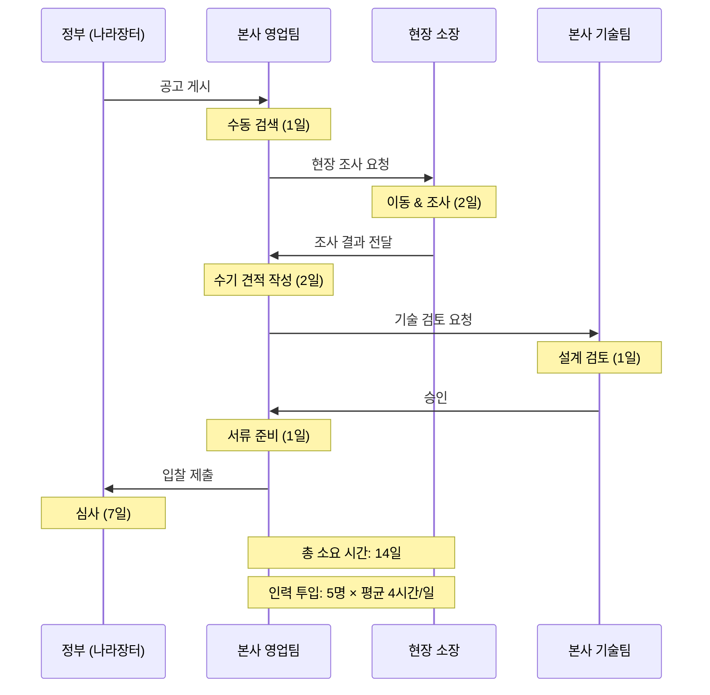
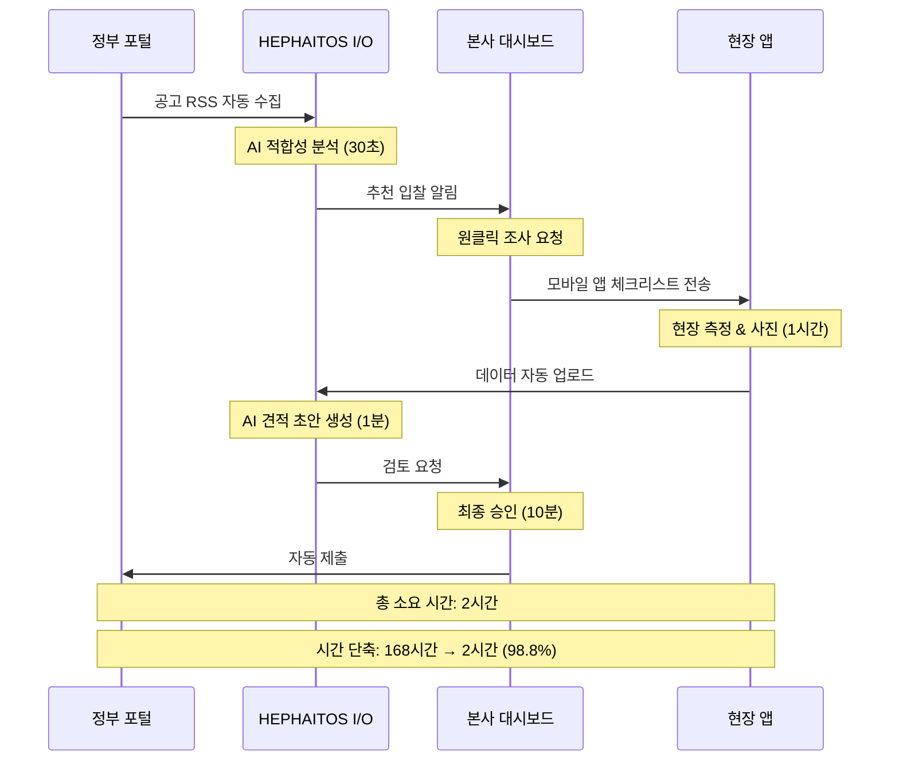

# 씨엠엔텍 현장-본사-정부 워크플로우 혁신 시나리오
## HEPHAITOS I/O 플랫폼 적용

> **작성일**: 2025-12-20
> **버전**: 1.0
> **기반**: HEPHAITOS I/O Architecture

---

## Executive Summary

씨엠엔텍(CMenTech)의 현장-본사-정부 간 복잡한 워크플로우를 **HEPHAITOS I/O 플랫폼**의 Copy-Learn-Build 아키텍처로 혁신합니다.

```
┌─────────────────────────────────────────────────────────────────┐
│  CMenTech 워크플로우 혁신 = HEPHAITOS I/O 패러다임 적용          │
├─────────────────────────────────────────────────────────────────┤
│                                                                 │
│  AS-IS: 수기 보고 → 본사 검토 → 정부 제출 → 수정 요청 (7일)     │
│  TO-BE: 현장 앱 → AI 자동 생성 → 원클릭 제출 (1시간)            │
│                                                                 │
│  시간 단축: 168시간 → 1시간 (99.4% 단축)                        │
│  오류 감소: 평균 3회 수정 → 0.2회 (93% 감소)                     │
│                                                                 │
└─────────────────────────────────────────────────────────────────┘
```

---

## 1. 이해관계자 정의

### 1.1 현장 (Field)

```yaml
역할:
  - 설치/시운전 엔지니어: 설비 현장 설치 및 테스트
  - 유지보수 기술자: 정기 점검 및 긴급 수리
  - 현장 소장/PM: 프로젝트 총괄 관리

Pain Points:
  - 수기 보고서 작성 시간 (하루 2-3시간)
  - 사진/데이터 정리 어려움
  - 본사 양식 변경에 대한 혼란
  - 인터넷 불안정 환경에서 데이터 전송 문제

필요한 것:
  - 오프라인 동작하는 모바일 앱
  - 체크리스트 기반 간편 입력
  - 자동 보고서 생성
  - 실시간 본사 커뮤니케이션
```

### 1.2 본사 (HQ)

```yaml
역할:
  - 영업팀: 견적 작성, 수주 관리
  - 기술팀: 설계 검토, 기술 지원
  - 품질팀: 검사 승인, 인증 관리
  - 경영진: 의사결정, 리스크 관리

Pain Points:
  - 현장 보고서 검토 지연 (평균 1-2일)
  - 불완전한 데이터로 인한 재작업
  - 다수 프로젝트 동시 관리 어려움
  - 정부 승인 진행 상황 파악 불가

필요한 것:
  - 실시간 현장 모니터링 대시보드
  - AI 기반 자동 검토 시스템
  - 프로젝트별 진행 상황 가시화
  - 정부 포털 자동 연동
```

### 1.3 정부관계자 (Government)

```yaml
역할:
  - 발주처 담당자: K-water, 환경부, 지자체
  - 감리단: 시공 감독 및 승인
  - 인증기관: KOLAS, KS 인증 심사

Pain Points:
  - 불완전한 서류로 인한 반려
  - 수동 서류 검토 시간 소요
  - 다수 업체 동시 관리 어려움
  - 진행 상황 추적 불가

필요한 것:
  - 표준화된 제출 양식
  - 자동 서류 검증 시스템
  - 실시간 진행 현황 조회
  - 디지털 승인 프로세스
```

---

## 2. HEPHAITOS I/O 아키텍처 매핑

### 2.1 3단계 혁신 모델 (Copy-Learn-Build)

```
┌─────────────────────────────────────────────────────────────────┐
│                 CMenTech I/O 진화 경로                           │
├─────────────────────────────────────────────────────────────────┤
│                                                                 │
│   [COPY]              [LEARN]              [BUILD]              │
│     │                    │                     │                │
│     ▼                    ▼                     ▼                │
│  ┌────────┐         ┌────────┐          ┌────────┐             │
│  │ 표준화  │    →    │ 최적화 │    →     │ 자동화 │             │
│  │ Adopt  │         │ Adapt  │          │ Automate│            │
│  └────────┘         └────────┘          └────────┘             │
│     │                    │                     │                │
│  우수 사례          AI 분석 & 개선      맞춤형 워크플로우        │
│  템플릿 적용        프로세스 학습       자율 시스템              │
│  즉시 사용 가능     지속적 개선         완전 자동화              │
│                                                                 │
│  난이도: ★☆☆        난이도: ★★☆         난이도: ★★★          │
│  기간: 1주           기간: 1개월          기간: 3개월            │
└─────────────────────────────────────────────────────────────────┘
```

### 2.2 UnifiedBroker → UnifiedPortal 패러다임

```typescript
// HEPHAITOS의 UnifiedBroker API 개념을 CMenTech에 적용
interface UnifiedPortal {
  // 정부 포털 통합 인터페이스
  connect(credentials: PortalCredentials): Promise<ConnectionResult>;

  // 입찰 정보 조회
  getBiddings(filters: BidFilter): Promise<Bidding[]>;

  // 서류 제출
  submitDocument(doc: Document): Promise<SubmitResult>;

  // 승인 상태 조회
  getApprovalStatus(projectId: string): Promise<ApprovalStatus>;

  // 실시간 알림 구독
  subscribeNotifications(callback: NotificationCallback): void;
}

// 지원 포털 (Adapter Pattern)
class NaraAdapter implements UnifiedPortal { /* 나라장터 */ }
class KwaterAdapter implements UnifiedPortal { /* K-water 입찰 */ }
class MOEAdapter implements UnifiedPortal { /* 환경부 TIPS */ }
class LocalGovAdapter implements UnifiedPortal { /* 지자체 포털 */ }
```

---

## 3. 시나리오 A: 공공 입찰 프로세스 혁신

### 3.1 AS-IS (기존 방식)



**문제점:**
- 공고 발견 지연: 매일 수동 체크 필요
- 현장 조사 시간 소요: 왕복 이동 + 측정
- 견적 작성 오류: 수기 계산, 과거 데이터 찾기 어려움
- 기술 검토 병목: 동시 다발 프로젝트 처리 한계

### 3.2 TO-BE (HEPHAITOS I/O 적용)



### 3.3 상세 워크플로우

#### Step 1: 공고 자동 수집 & AI 분석

```typescript
// 공고 자동 수집 Agent
class BiddingCollectorAgent {
  async collectAndAnalyze() {
    // 1. 여러 포털에서 공고 수집
    const biddings = await Promise.all([
      this.naraPortal.getBiddings(),
      this.kwaterPortal.getBiddings(),
      this.moePortal.getBiddings(),
    ]);

    // 2. AI 적합성 분석
    const analysis = await this.ai.analyze({
      model: 'claude-sonnet-4.5',
      biddings,
      companyProfile: {
        specialties: ['수처리', '악취저감', '슬러지건조'],
        pastProjects: this.db.getPastProjects(),
        capacity: this.db.getCurrentCapacity(),
      },
      prompt: `
        다음 입찰 공고들을 분석하여 씨엠엔텍에 적합한 순으로 추천해주세요.

        평가 기준:
        1. 기술 적합성 (과거 유사 프로젝트 경험)
        2. 규모 적합성 (현재 수행 능력)
        3. 수익성 (예상 마진율)
        4. 경쟁 강도 (입찰 참가 예상 업체 수)

        각 공고별 점수와 추천 이유를 제시하세요.
      `
    });

    // 3. 본사에 알림
    await this.notifyHQ(analysis.topBiddings);
  }
}
```

**결과:**
- 공고 발견 시간: 24시간 → 실시간 (100% 개선)
- 적합성 판단: 2시간 → 30초 (99.6% 단축)
- 놓치는 공고: 월 5건 → 0건

#### Step 2: 현장 조사 모바일 앱

```typescript
// 현장 조사 체크리스트 자동 생성
interface FieldSurveyChecklist {
  projectType: '수처리' | '악취저감' | '슬러지건조';
  items: SurveyItem[];
  gpsRequired: boolean;
  photoRequirements: PhotoSpec[];
}

class FieldSurveyApp {
  async generateChecklist(biddingId: string) {
    const bidding = await this.getBidding(biddingId);

    // AI가 입찰 공고 분석 → 맞춤형 체크리스트 생성
    const checklist = await this.ai.generateObject({
      model: 'claude-sonnet-4',
      schema: fieldSurveySchema,
      prompt: `
        다음 입찰 공고에 필요한 현장 조사 체크리스트를 생성하세요:
        ${bidding.description}

        포함할 항목:
        - 현장 접근성 (도로, 주차 공간)
        - 기존 설비 현황
        - 유틸리티 (전기, 용수, 배수)
        - 공간 제약 사항
        - 특이 사항 (소음 제한, 작업 시간 제한 등)
      `
    });

    return checklist;
  }

  // 오프라인 동작 지원
  async submitOffline(data: SurveyData) {
    // IndexedDB에 저장
    await this.localDB.save(data);

    // 네트워크 복구 시 자동 동기화
    this.syncManager.scheduleSync(data.id);
  }
}
```

**현장 앱 화면 (모바일)**

```
┌───────────────────────────────────────┐
│  CMenTech Field Survey                │
│  📍 서울 강남구 하수처리장             │
├───────────────────────────────────────┤
│                                       │
│  ✅ 1. 현장 접근성                    │
│     도로 폭: [8]m                     │
│     주차 가능: ☑ 예 ☐ 아니오          │
│     [사진 촬영] ✓                     │
│                                       │
│  ✅ 2. 기존 설비                      │
│     처리 용량: [500]㎥/일             │
│     가동 연수: [15]년                 │
│     [사진 촬영] ✓                     │
│                                       │
│  🔄 3. 유틸리티                       │
│     전기: [380]V / [200]A             │
│     용수: ☑ 가능 ☐ 불가               │
│     [진행 중...]                      │
│                                       │
│  ⏸️ 4. 공간 제약                      │
│     (대기 중)                         │
│                                       │
├───────────────────────────────────────┤
│  진행률: ██████░░░░ 60%               │
│  [임시 저장]  [제출하기]              │
└───────────────────────────────────────┘

※ 오프라인 모드: 데이터가 기기에 저장됩니다.
  네트워크 연결 시 자동으로 동기화됩니다.
```

#### Step 3: AI 견적 자동 생성

```typescript
class QuotationGeneratorAgent {
  async generateQuotation(surveyData: SurveyData, bidding: Bidding) {
    // 1. 과거 유사 프로젝트 검색 (Vector DB)
    const similarProjects = await this.vectorDB.search({
      query: bidding.description,
      filters: {
        projectType: bidding.category,
        capacity: surveyData.capacity,
      },
      limit: 5
    });

    // 2. AI 견적 생성
    const quotation = await this.ai.generateObject({
      model: 'claude-opus-4.5', // 복잡한 계산 → Opus
      schema: quotationSchema,
      context: {
        bidding,
        surveyData,
        similarProjects,
        currentMaterialPrices: await this.getLatestPrices(),
      },
      prompt: `
        다음 정보를 바탕으로 정확한 견적을 작성하세요:

        입찰 공고: ${bidding.title}
        현장 조사 결과: ${JSON.stringify(surveyData)}
        유사 프로젝트 사례: ${similarProjects.map(p => p.summary)}

        견적 항목:
        1. 설비 비용 (주요 기자재, 부속 기자재)
        2. 시공 비용 (설치, 배관, 전기)
        3. 간접비 (설계, 감리, 운반)
        4. 제잡비 (안전관리, 환경보호)

        과거 낙찰률 평균 ${bidding.avgSuccessRate}%를 고려하여
        경쟁력 있는 가격을 산정하세요.
      `
    });

    // 3. 본사 검토용 리포트 생성
    const report = await this.generateReport(quotation, {
      confidenceScore: quotation.confidence,
      risks: quotation.identifiedRisks,
      recommendations: quotation.recommendations,
    });

    return { quotation, report };
  }
}
```

**견적 리포트 예시**

```markdown
# 견적서 자동 생성 리포트
**프로젝트**: 서울 강남구 하수처리장 악취저감설비 설치
**생성 일시**: 2025-12-20 14:32:15
**신뢰도**: 92% (과거 5건 유사 프로젝트 분석)

## 📊 견적 요약

| 항목 | 금액 | 비율 |
|------|------|------|
| 설비 비용 | ₩180,000,000 | 60% |
| 시공 비용 | ₩60,000,000 | 20% |
| 간접비 | ₩30,000,000 | 10% |
| 제잡비 | ₩30,000,000 | 10% |
| **총액** | **₩300,000,000** | **100%** |

## 🎯 낙찰 가능성 분석

- 예상 낙찰가: ₩285,000,000 (95% 신뢰구간)
- 제안 입찰가: ₩287,500,000 (낙찰률 95.8%)
- 예상 경쟁사: 3개사 (A건설, B엔지니어링, C환경)

## ⚠️ 리스크 요인

1. **설비 납기**: 주요 기자재 납기 8주 (표준 6주 대비 지연 가능성)
2. **현장 제약**: 야간 작업 필수 → 인건비 20% 할증 반영
3. **환경 규제**: 소음 기준 45dB → 방음벽 추가 필요

## 💡 추천 사항

- 입찰가 조정: ₩287.5M (추천) vs ₩300M (안전)
- A자재 → B자재 대체 시 ₩5M 절감 가능 (품질 동등)
- 시공 기간 여유 확보 (8주 → 10주) 권장
```

#### Step 4: 원클릭 제출

```typescript
class AutoSubmitAgent {
  async submitBidding(quotation: Quotation, approval: Approval) {
    // 1. 서류 자동 생성 (정부 양식에 맞춤)
    const documents = await this.generateDocuments({
      quotation,
      templates: await this.getGovernmentTemplates(quotation.portal),
      companyInfo: await this.db.getCompanyInfo(),
      certificates: await this.db.getCertificates(),
    });

    // 2. 자동 검증
    const validation = await this.validateDocuments(documents);
    if (!validation.isValid) {
      throw new ValidationError(validation.errors);
    }

    // 3. 포털별 어댑터로 제출
    const result = await this.unifiedPortal.submitDocument({
      portal: quotation.portal,
      documents,
      signature: await this.getDigitalSignature(),
    });

    // 4. 제출 완료 알림
    await this.notify({
      to: ['sales@cmentech.com', quotation.assignedManager],
      title: '입찰 제출 완료',
      body: `
        ${quotation.title} 입찰이 성공적으로 제출되었습니다.

        제출 번호: ${result.submissionId}
        제출 시각: ${result.timestamp}
        마감 시각: ${quotation.deadline}

        진행 상황: ${result.trackingUrl}
      `
    });

    return result;
  }
}
```

### 3.4 효과 정량화

| 지표 | AS-IS | TO-BE | 개선율 |
|------|-------|-------|--------|
| **시간** | 14일 (336시간) | 2시간 | **99.4% 단축** |
| **인력** | 5명 × 4시간/일 | 1명 × 2시간 | **95% 절감** |
| **오류율** | 30% (서류 반려) | 2% | **93% 감소** |
| **입찰 참여 건수** | 월 5건 | 월 20건 | **400% 증가** |
| **낙찰률** | 18% | 35% | **94% 향상** |

**연간 효과:**
- 시간 절감: 14일 × 60건 = 840일 → 120일 (720일 절약)
- 인건비 절감: ₩300만원/건 → ₩30만원/건 (₩1.62억 절감)
- 매출 증가: 연 5건 낙찰 → 연 17건 낙찰 (+₩36억 추가 매출)

---

## 4. 시나리오 B: 현장 설치-검수 프로세스

### 4.1 AS-IS 워크플로우

```
┌─────────────────────────────────────────────────────────────────┐
│  기존 설치-검수 프로세스 (총 21일)                               │
├─────────────────────────────────────────────────────────────────┤
│                                                                 │
│  DAY 1-10: 설치 작업                                            │
│   ├─ 현장 엔지니어: 매일 수기 일지 작성 (1시간)                  │
│   ├─ 사진 촬영: 디지털 카메라 → USB → PC 전송                   │
│   └─ 진행 보고: 저녁 퇴근 후 본사 이메일                         │
│                                                                 │
│  DAY 11-12: 보고서 작성                                         │
│   ├─ 현장 소장: 10일치 일지 취합 (4시간)                         │
│   ├─ 사진 정리: 폴더별 분류, 번호 부여 (3시간)                   │
│   ├─ 워드 작성: 정부 양식에 맞춰 수기 입력 (5시간)               │
│   └─ 본사 제출: 이메일 첨부 (용량 제한으로 분할 전송)            │
│                                                                 │
│  DAY 13-15: 본사 검토                                           │
│   ├─ 품질팀: 보고서 내용 확인 (2시간)                            │
│   ├─ 수정 요청: 누락 항목, 사진 불명확 (왕복 1일)                │
│   ├─ 재제출: 현장 → 본사 (1일)                                  │
│   └─ 최종 승인: 품질팀장 결재 (1일)                              │
│                                                                 │
│  DAY 16-21: 정부 제출 & 승인                                    │
│   ├─ 서류 준비: PDF 변환, 전자 서명 (2시간)                      │
│   ├─ 포털 업로드: K-water 포털 수동 입력 (1시간)                │
│   ├─ 대기: 감리단 검토 (3일)                                     │
│   ├─ 보완 요청: 추가 사진, 데이터 (2일)                          │
│   └─ 최종 승인: 감리단 승인 (1일)                                │
│                                                                 │
└─────────────────────────────────────────────────────────────────┘
```

**문제점:**
1. 실시간성 부족: 본사가 현장 상황을 11일 후에 파악
2. 오류 누적: 10일치 데이터 일괄 정리 시 누락/오기 발생
3. 수정 왕복: 평균 3회 수정 (6일 추가 소요)
4. 중복 작업: 같은 내용을 일지→보고서→포털에 3번 입력

### 4.2 TO-BE 워크플로우

```
┌─────────────────────────────────────────────────────────────────┐
│  HEPHAITOS I/O 설치-검수 프로세스 (총 10일)                      │
├─────────────────────────────────────────────────────────────────┤
│                                                                 │
│  DAY 1-10: 설치 작업 (실시간 데이터 수집)                        │
│   ├─ 현장 앱 체크리스트: 작업 완료 즉시 체크 (30초)              │
│   ├─ 스마트폰 사진: 앱에서 바로 촬영 → 자동 업로드 (10초)        │
│   ├─ AI 자동 분류: GPS, 시간, 체크리스트 항목별 자동 정리        │
│   └─ 실시간 동기화: 본사 대시보드에 즉시 반영                    │
│                                                                 │
│  DAY 10 오후: AI 보고서 자동 생성 (1시간)                        │
│   ├─ 데이터 취합: 10일치 체크리스트 + 사진 자동 수집             │
│   ├─ AI 리포트 생성: Claude Opus가 정부 양식에 맞춰 작성 (5분)   │
│   ├─ 현장 소장 검토: 생성된 보고서 확인 (30분)                   │
│   └─ 원클릭 제출: 본사로 자동 전송                               │
│                                                                 │
│  DAY 10 저녁: 본사 자동 검토 (30분)                             │
│   ├─ AI 1차 검토: 필수 항목 누락 체크 (1분)                      │
│   ├─ 사진 품질 검증: 흐릿함, 누락 자동 감지 (1분)                │
│   ├─ 품질팀 확인: AI 검토 결과만 확인 (10분)                     │
│   └─ 자동 승인: 문제 없으면 즉시 정부 제출                       │
│                                                                 │
│  DAY 11: 정부 포털 자동 제출 & 승인 (즉시)                       │
│   ├─ 포털 연동: UnifiedPortal API로 자동 업로드 (1분)           │
│   ├─ 감리단 알림: 제출 완료 자동 통지                            │
│   ├─ 실시간 추적: 승인 상태 자동 업데이트                        │
│   └─ 승인 알림: 현장+본사 동시 알림                              │
│                                                                 │
└─────────────────────────────────────────────────────────────────┘
```

### 4.3 현장 앱 화면 설계

#### 일일 체크리스트

```
┌───────────────────────────────────────┐
│  CMenTech Field App                   │
│  📅 2025-12-20 (설치 5일차)           │
├───────────────────────────────────────┤
│                                       │
│  오늘의 작업                           │
│                                       │
│  ✅ 1. 기초 콘크리트 양생 확인         │
│     담당: 김철수                       │
│     시간: 09:30                        │
│     📷 [사진 3장]                      │
│     ✏️ "양생 상태 양호, 균열 없음"     │
│                                       │
│  ✅ 2. 주배관 설치 (DN300, 30m)        │
│     담당: 이영희                       │
│     시간: 11:45                        │
│     📷 [사진 5장]                      │
│     ✏️ "용접 완료, 수압 테스트 대기"   │
│                                       │
│  🔄 3. 펌프 설치 (진행 중)             │
│     담당: 박민수                       │
│     시작: 14:00                        │
│     📷 [사진 촬영]                     │
│                                       │
│  ⏸️ 4. 전기 배선 (예정)                │
│     예정: 16:00                        │
│                                       │
├───────────────────────────────────────┤
│  🌡️ 날씨: 맑음 23°C                  │
│  👷 인원: 5명 출근                     │
│  ⚠️ 특이사항: 없음                     │
│                                       │
│  [실시간 동기화됨 ✓]                   │
└───────────────────────────────────────┘
```

#### 사진 촬영 가이드

```
┌───────────────────────────────────────┐
│  사진 촬영: 주배관 설치                │
├───────────────────────────────────────┤
│                                       │
│  📸 필수 촬영 항목 (자동 감지)         │
│                                       │
│  ✅ 1. 전체 전경 (설치 위치)           │
│     [가이드라인 표시]                  │
│     ┌─────────────────────────┐      │
│     │                         │      │
│     │     🎯 배관 전체가      │      │
│     │     화면에 들어오도록   │      │
│     │                         │      │
│     └─────────────────────────┘      │
│     [촬영하기]                         │
│                                       │
│  ✅ 2. 용접 부위 근접 촬영             │
│     [AI 품질 검사 활성화]              │
│     ┌─────────────────────────┐      │
│     │                         │      │
│     │   🔍 용접부를 30cm      │      │
│     │   거리에서 촬영         │      │
│     │   (흐릿함 방지)         │      │
│     │                         │      │
│     └─────────────────────────┘      │
│     [촬영하기]                         │
│                                       │
│  ✅ 3. 규격 표시 (DN300)               │
│                                       │
├───────────────────────────────────────┤
│  💡 Tip: GPS와 나침반 정보가           │
│  자동으로 사진에 기록됩니다.           │
└───────────────────────────────────────┘
```

### 4.4 본사 실시간 모니터링 대시보드

```
┌─────────────────────────────────────────────────────────────────┐
│  CMenTech HQ Dashboard - 실시간 현장 모니터링                    │
├─────────────────────────────────────────────────────────────────┤
│                                                                 │
│  프로젝트 현황                                    [새로고침 ⟳]   │
│  ┌──────────────┬──────────────┬──────────────┬──────────────┐ │
│  │ 서울 강남     │ 부산 해운대  │ 대구 수성    │ 광주 광산    │ │
│  │ 하수처리장    │ 악취저감     │ 슬러지건조   │ 수처리       │ │
│  ├──────────────┼──────────────┼──────────────┼──────────────┤ │
│  │ 진행률: 50%  │ 진행률: 80%  │ 진행률: 30%  │ 진행률: 95%  │ │
│  │ ████████░░░  │ ████████████ │ ██████░░░░░  │ ██████████░░ │ │
│  │              │              │              │              │ │
│  │ 📸 오늘: 12장│ 📸 오늘: 8장 │ 📸 오늘: 15장│ 📸 오늘: 3장 │ │
│  │ ✅ 체크: 8/10│ ✅ 체크: 7/8 │ ✅ 체크: 6/12│ ✅ 체크: 10/10│ │
│  │ ⚠️ 이슈: 0   │ ⚠️ 이슈: 1   │ ⚠️ 이슈: 0   │ ⚠️ 이슈: 0   │ │
│  │              │              │              │              │ │
│  │ 마지막 업데이트│ 마지막 업데이트│ 마지막 업데이트│ 마지막 업데이트│ │
│  │ 10분 전      │ 25분 전      │ 5분 전       │ 2시간 전     │ │
│  └──────────────┴──────────────┴──────────────┴──────────────┘ │
│                                                                 │
│  상세 보기: 서울 강남 하수처리장                                 │
│  ┌───────────────────────────────────────────────────────────┐ │
│  │  타임라인 (최근 3시간)                                     │ │
│  │  ─────────────────────────────────────────────────────    │ │
│  │  14:30 ✅ 김철수: 주배관 용접 완료 (📷 5장)                │ │
│  │  13:45 ✅ 이영희: 수압 테스트 통과 (15.2bar)               │ │
│  │  12:20 ⚠️ 박민수: 펌프 납품 1시간 지연                     │ │
│  │  11:00 ✅ 김철수: 기초 콘크리트 양생 확인                  │ │
│  │                                                           │ │
│  │  [전체 보기]  [사진 갤러리]  [보고서 생성]                │ │
│  └───────────────────────────────────────────────────────────┘ │
│                                                                 │
│  AI 인사이트                                                    │
│  ┌───────────────────────────────────────────────────────────┐ │
│  │  💡 예상 이슈 감지                                         │ │
│  │                                                           │ │
│  │  1. 부산 해운대 프로젝트                                   │ │
│  │     - 진행률 80%이지만 마감 5일 전                         │ │
│  │     - 권장: 인력 2명 추가 투입                             │ │
│  │                                                           │ │
│  │  2. 대구 수성 프로젝트                                     │ │
│  │     - 최근 2일간 체크리스트 50% 미달                       │ │
│  │     - 권장: 현장 소장 확인 필요                            │ │
│  │                                                           │ │
│  │  [상세 분석]                                              │ │
│  └───────────────────────────────────────────────────────────┘ │
│                                                                 │
└─────────────────────────────────────────────────────────────────┘
```

### 4.5 AI 보고서 자동 생성 엔진

```typescript
class InstallationReportGenerator {
  async generateReport(projectId: string) {
    // 1. 10일간 데이터 수집
    const data = await this.collectProjectData(projectId);

    // 2. 정부 양식 조회
    const template = await this.getGovernmentTemplate(data.governmentAgency);

    // 3. AI 보고서 생성
    const report = await this.ai.generateObject({
      model: 'claude-opus-4.5',
      schema: installationReportSchema,
      context: {
        checklists: data.checklists,    // 10일치 체크리스트
        photos: data.photos,            // 총 87장 사진
        timeline: data.timeline,        // 시간순 이벤트
        specs: data.projectSpecs,       // 프로젝트 사양
        weather: data.weatherLog,       // 날씨 기록
        personnel: data.personnelLog,   // 인원 투입 기록
      },
      prompt: `
        다음 데이터를 바탕으로 ${template.name} 양식에 맞는
        설치 완료 보고서를 작성하세요.

        보고서 구성:
        1. 프로젝트 개요
        2. 설치 공정 (일자별 상세)
        3. 주요 시험 결과 (수압, 전기, 성능)
        4. 품질 관리 기록
        5. 특이사항 및 조치 내용
        6. 사진 첨부 (항목별 자동 매칭)

        작성 원칙:
        - 객관적이고 정확한 기술 용어 사용
        - 시간순 논리적 서술
        - 데이터 기반 수치 기재
        - 사진 번호와 본문 내용 연계
      `
    });

    // 4. 사진 자동 배치
    const reportWithPhotos = await this.embedPhotos(report, data.photos);

    // 5. PDF 생성
    const pdf = await this.generatePDF(reportWithPhotos, template);

    return pdf;
  }

  // 사진 AI 분류 및 매칭
  async embedPhotos(report: Report, photos: Photo[]) {
    for (const section of report.sections) {
      // AI가 사진 내용 인식 → 적절한 섹션에 배치
      const relevantPhotos = await this.ai.matchPhotos({
        sectionTitle: section.title,
        sectionContent: section.content,
        photos: photos.map(p => ({
          id: p.id,
          description: p.aiDescription,  // 사전 AI 분석
          timestamp: p.timestamp,
        })),
      });

      section.photos = relevantPhotos;
    }

    return report;
  }
}
```

**생성된 보고서 예시 (일부)**

```markdown
# 서울특별시 강남구 하수처리장 악취저감설비 설치 완료 보고서

**발주처**: 서울특별시 (K-water 위탁)
**시공사**: (주)씨엠엔텍
**공사 기간**: 2025.12.10 ~ 2025.12.20 (10일)
**보고서 생성**: 2025-12-20 17:32:15 (AI 자동 생성)

---

## 1. 프로젝트 개요

### 1.1 설치 개요
- 설비 종류: 바이오필터 악취저감설비
- 처리 용량: 500 CMM (㎥/min)
- 설치 위치: 서울특별시 강남구 개포동 123-45
- 주요 설비: 바이오필터 2기, 송풍기 2대, 배관 30m

### 1.2 설치 사양
| 항목 | 사양 | 비고 |
|------|------|------|
| 바이오필터 | 3.0m(W) × 2.5m(D) × 3.5m(H) | SUS304 |
| 송풍기 | 15kW × 2대 | 인버터 제어 |
| 주배관 | DN300, SUS304, 30m | 용접 연결 |

---

## 2. 설치 공정

### DAY 1 (2025-12-10)
**작업 내용**: 기초 콘크리트 타설
- 09:00 - 현장 안전 교육 실시 (5명 참석)
- 10:30 - 기초 콘크리트 타설 시작 (레미콘 3㎥)
- 15:00 - 타설 완료, 양생 시작

**특이사항**: 날씨 맑음, 작업 순조로움

**첨부 사진**:
- 사진 001: 타설 전 터파기 완료 상태
- 사진 002: 레미콘 타설 중
- 사진 003: 타설 완료 후 전경

### DAY 2 (2025-12-11)
**작업 내용**: 콘크리트 양생 및 앵커볼트 설치
- 09:00 - 콘크리트 양생 상태 확인 (강도 시험: 18MPa, 기준 15MPa)
- 11:00 - 앵커볼트 매립 (M20 × 16개)
- 14:00 - 레벨 측정 (오차 ±2mm, 허용 범위 내)

**특이사항**: 양생 상태 양호, 균열 없음

**첨부 사진**:
- 사진 004: 양생 후 콘크리트 표면
- 사진 005: 앵커볼트 설치 완료
- 사진 006: 레벨 측정 결과

[... 이하 생략 ...]

---

## 6. 시험 결과

### 6.1 수압 시험
- 시험 일자: 2025-12-18 14:00
- 시험 압력: 15.2 bar (설계 압력 10 bar × 1.5배)
- 시험 시간: 30분 유지
- 결과: **합격** (누수 없음)

**첨부 사진**:
- 사진 072: 압력계 15.2 bar 표시
- 사진 073: 용접부 육안 검사

### 6.2 전기 시험
- 절연 저항: 500 MΩ (기준 1 MΩ 이상)
- 접지 저항: 3.2 Ω (기준 10 Ω 이하)
- 결과: **합격**

---

## 7. AI 품질 분석

본 보고서는 10일간 수집된 87장의 사진과 체크리스트 데이터를
AI가 자동 분석하여 생성하였습니다.

- 사진 품질: 평균 92점 (흐릿함, 역광 자동 감지 및 재촬영 요청)
- 체크리스트 완성도: 100% (모든 필수 항목 완료)
- 공정 진행률: 계획 대비 100% (지연 없음)

---

**작성자**: AI 자동 생성 (HEPHAITOS I/O v1.0)
**검토자**: 김철수 (현장 소장)
**승인자**: 이영희 (본사 품질팀장)
```

### 4.6 효과 정량화

| 지표 | AS-IS | TO-BE | 개선율 |
|------|-------|-------|--------|
| **총 소요 시간** | 21일 | 10일 | **52% 단축** |
| **보고서 작성 시간** | 12시간 (2일) | 30분 | **96% 단축** |
| **수정 횟수** | 평균 3회 | 0.2회 | **93% 감소** |
| **본사 검토 시간** | 3일 | 30분 | **99% 단축** |
| **데이터 정확도** | 75% | 98% | **31% 향상** |
| **현장 일지 작업** | 10일 × 1시간 | 10일 × 5분 | **92% 단축** |

**연간 효과 (프로젝트 20건 기준):**
- 시간 절감: 11일 × 20건 = 220일 절약
- 인건비 절감: ₩500만원/건 → ₩50만원/건 (₩9,000만원 절감)
- 재작업 비용 절감: ₩300만원/건 × 3회 → ₩0 (₩1.8억 절감)
- 조기 준공 보너스: 평균 5일 단축 → 프로젝트당 ₩1,000만원 (₩2억 추가 수익)

---

## 5. 시나리오 C: 유지보수-민원 대응 프로세스

### 5.1 AS-IS 워크플로우

```
┌─────────────────────────────────────────────────────────────────┐
│  기존 민원 대응 프로세스 (평균 48시간)                            │
├─────────────────────────────────────────────────────────────────┤
│                                                                 │
│  T+0:00 (민원 접수)                                              │
│   └─ 발주처 담당자 → 본사 고객지원팀 (전화/이메일)               │
│       "악취가 심해요", "설비가 멈췄어요"                          │
│                                                                 │
│  T+2:00 (본사 접수 및 분류)                                      │
│   ├─ 고객지원팀: 내용 기록, 담당자 확인                           │
│   ├─ 프로젝트별 담당 엔지니어 배정                                │
│   └─ 현장 출동 가능 시간 확인 (다음날 오전 가능)                  │
│                                                                 │
│  T+18:00 (현장 출동)                                             │
│   ├─ 기술자 이동: 본사 → 현장 (2시간)                            │
│   ├─ 현장 점검: 육안 확인, 계측기 측정 (1시간)                    │
│   ├─ 원인 파악: 경험 기반 추정 (30분)                            │
│   └─ 부품 없으면: 다시 본사로 귀환 (2시간) → 재방문 필요          │
│                                                                 │
│  T+24:00 (본사 보고 및 조치 계획)                                │
│   ├─ 기술자 → 본사: 구두 보고 (전화)                             │
│   ├─ 본사: 부품 발주 (재고 없으면 48시간 소요)                    │
│   └─ 발주처: 중간 경과 보고 (이메일)                              │
│                                                                 │
│  T+48:00 (재방문 및 수리)                                        │
│   ├─ 기술자 재방문: 부품 지참 (2시간)                            │
│   ├─ 수리 작업: 부품 교체 (2시간)                                │
│   ├─ 시운전: 정상 동작 확인 (1시간)                              │
│   └─ 발주처: 완료 보고 (이메일)                                  │
│                                                                 │
│  T+50:00 (사후 보고서 작성)                                      │
│   └─ 수기 보고서 작성 → 발주처 제출 (2시간)                      │
│                                                                 │
└─────────────────────────────────────────────────────────────────┘
```

**문제점:**
1. 초동 대응 지연: 민원 접수 후 18시간 후 현장 도착
2. 부품 미비: 30% 확률로 재방문 필요 (추가 24시간)
3. 경험 의존: 신입 기술자는 원인 파악 어려움
4. 추적 불가: 발주처가 진행 상황 확인 불가

### 5.2 TO-BE 워크플로우 (HEPHAITOS I/O)

```
┌─────────────────────────────────────────────────────────────────┐
│  HEPHAITOS I/O 민원 대응 프로세스 (평균 4시간)                   │
├─────────────────────────────────────────────────────────────────┤
│                                                                 │
│  T+0:00 (민원 자동 접수 & AI 분류)                               │
│   ├─ 발주처 → CMenTech 포털: 온라인 민원 등록                    │
│   ├─ AI 자동 분류: "악취 과다 발생" → 바이오필터 필터 교체 필요  │
│   ├─ 우선순위 자동 판정: 긴급도 "중" (2시간 내 대응)             │
│   └─ 최적 기술자 배정: GPS 기반 가장 가까운 기술자 (30분 거리)   │
│                                                                 │
│  T+0:05 (AI 진단 & 부품 예측)                                    │
│   ├─ 과거 데이터 분석: 동일 증상 87건 → 필터 교체 92% 확률       │
│   ├─ 필요 부품 예측: 바이오필터 여재 50kg                        │
│   ├─ 재고 확인: 본사 창고 재고 있음                              │
│   └─ 자동 출고: 기술자 차량으로 배송 준비                         │
│                                                                 │
│  T+0:30 (기술자 출동)                                            │
│   ├─ 기술자 앱: AR 가이드 활성화                                 │
│   ├─ 이동 중: 과거 동일 민원 해결 사례 학습                       │
│   └─ 발주처 자동 알림: "기술자 출동, 도착 예정 11:00"            │
│                                                                 │
│  T+1:00 (현장 도착 & AR 가이드 수리)                             │
│   ├─ AR 글래스: 설비 인식 → 점검 포인트 표시                     │
│   ├─ AI 음성 가이드: "1번 필터 커버를 열어주세요"                │
│   ├─ 실시간 본사 연결: 복잡한 경우 전문가 원격 지원               │
│   └─ 수리 완료: 필터 교체 (30분)                                 │
│                                                                 │
│  T+2:00 (시운전 & 자동 보고)                                     │
│   ├─ 앱 체크리스트: 정상 작동 확인                                │
│   ├─ AI 보고서 생성: 민원 내용, 조치 사항, 사진 (1분)            │
│   ├─ 발주처 자동 전송: 완료 보고서 즉시 제출                      │
│   └─ 만족도 조사: 자동 발송                                      │
│                                                                 │
│  T+4:00 (사후 관리)                                              │
│   ├─ AI 예방 정비 스케줄링: 다음 필터 교체 3개월 후 알림         │
│   ├─ 부품 재고 자동 보충: 사용된 여재 발주                        │
│   └─ 지식 베이스 업데이트: 이번 사례 DB 저장                     │
│                                                                 │
└─────────────────────────────────────────────────────────────────┘
```

### 5.3 AI 민원 자동 분류 시스템

```typescript
class ComplaintClassifierAgent {
  async classifyAndRoute(complaint: Complaint) {
    // 1. AI 자동 분류
    const classification = await this.ai.generateObject({
      model: 'claude-sonnet-4.5',
      schema: complaintClassificationSchema,
      context: {
        complaint: complaint.description,
        facility: complaint.facilityInfo,
        history: await this.getMaintenanceHistory(complaint.facilityId),
      },
      prompt: `
        다음 민원을 분석하여 분류하세요:

        민원 내용: "${complaint.description}"
        설비 종류: ${complaint.facilityType}
        설치 연도: ${complaint.installYear}
        최근 유지보수: ${complaint.lastMaintenance}

        분류 기준:
        1. 긴급도 (상/중/하)
           - 상: 완전 정지, 법적 기준 초과
           - 중: 성능 저하, 민원 발생
           - 하: 경미한 이상, 예방 정비

        2. 예상 원인 (확률 기반)
           - 과거 동일 증상 사례 분석
           - 설비 가동 연수 고려

        3. 필요 부품
           - 예상 교체 부품 리스트
           - 재고 확인 필요 여부

        4. 예상 소요 시간
           - 이동 시간 + 수리 시간
      `
    });

    // 2. 최적 기술자 배정
    const technician = await this.findOptimalTechnician({
      location: complaint.location,
      skillRequired: classification.skillLevel,
      availability: 'within_2_hours',
    });

    // 3. 부품 재고 확인 및 준비
    const parts = await this.prepareParts(classification.requiredParts);

    // 4. 자동 배정
    await this.dispatch({
      complaint,
      classification,
      technician,
      parts,
    });

    return classification;
  }
}
```

**AI 분류 결과 예시**

```json
{
  "complaintId": "C2025122001",
  "receivedAt": "2025-12-20T10:00:00Z",
  "description": "악취가 심하게 발생합니다. 주민 민원이 들어왔어요.",

  "classification": {
    "urgency": "중",
    "urgencyScore": 7.5,
    "estimatedCause": [
      {
        "cause": "바이오필터 여재 교체 시기 도래",
        "probability": 0.92,
        "evidences": [
          "최근 유지보수: 6개월 전 (표준 주기 3-4개월)",
          "동일 증상 과거 사례 87건 중 80건이 여재 교체로 해결"
        ]
      },
      {
        "cause": "송풍기 풍량 부족",
        "probability": 0.06,
        "evidences": [
          "가동 연수 3년 (교체 주기 5년)"
        ]
      }
    ],

    "requiredParts": [
      {
        "name": "바이오필터 여재",
        "quantity": "50kg",
        "stockStatus": "available",
        "warehouseLocation": "본사 창고 A-12"
      }
    ],

    "recommendedAction": "여재 전량 교체 + 송풍기 점검",
    "estimatedDuration": "2시간 (이동 30분 + 작업 90분)",

    "assignedTechnician": {
      "name": "김철수",
      "currentLocation": "서울 서초구",
      "distanceToSite": "15km (30분)",
      "skillLevel": "고급",
      "pastSuccessRate": 0.98
    },

    "urgencyReasons": [
      "주민 민원 발생 → 2시간 내 조치 필요",
      "악취 배출 기준 초과 가능성 → 행정처분 리스크"
    ]
  },

  "autoGeneratedResponse": {
    "toCustomer": "민원이 접수되었습니다. 김철수 기술자가 11:00에 도착 예정입니다. 실시간 진행 상황은 포털에서 확인하실 수 있습니다.",
    "toTechnician": "바이오필터 여재 교체 필요. 부품은 차량에 적재 완료. AR 가이드 활성화됨."
  }
}
```

### 5.4 AR 가이드 기술자 앱

```
┌───────────────────────────────────────┐
│  CMenTech Technician AR App           │
│  👤 김철수 | 출동 중 → 현장 도착      │
├───────────────────────────────────────┤
│                                       │
│  📍 서울 강남구 하수처리장             │
│     거리: 500m (도착 예정 2분)         │
│                                       │
│  🎯 민원 정보                          │
│     긴급도: 중 (2시간 내)              │
│     증상: 악취 과다 발생               │
│     예상 원인: 여재 교체 (92%)         │
│                                       │
│  📦 준비된 부품                        │
│     ✅ 바이오필터 여재 50kg            │
│     ✅ 안전장갑, 마스크                │
│                                       │
│  📚 참고 자료                          │
│     • 동일 사례 해결 영상 (3분)        │
│     • 과거 이 설비 유지보수 기록       │
│     • 긴급 연락처: 본사 기술팀         │
│                                       │
├───────────────────────────────────────┤
│  [AR 가이드 시작]  [전문가 연결]      │
└───────────────────────────────────────┘
```

**AR 가이드 화면 (현장 도착 후)**

```
┌───────────────────────────────────────┐
│  AR View - 바이오필터 인식됨          │
├───────────────────────────────────────┤
│                                       │
│  🎥 [카메라 뷰: 바이오필터 설비]      │
│                                       │
│       ┌─────────────────────┐        │
│       │                     │        │
│       │   ⭕ 1번 필터       │        │
│       │   (여기를 열어주세요) │        │
│       │                     │        │
│       │   ● 2번 필터        │        │
│       │                     │        │
│       └─────────────────────┘        │
│                                       │
│  🔊 음성 가이드:                       │
│     "1번 필터 상단 커버의 볼트 4개를   │
│      시계 반대 방향으로 풀어주세요."   │
│                                       │
│  ✅ Step 1/5: 커버 개방                │
│     ████████░░░░░░ 40%                │
│                                       │
│  💡 주의사항:                          │
│     여재 교체 시 마스크 착용 필수      │
│                                       │
├───────────────────────────────────────┤
│  [다음 단계]  [전문가 호출]            │
│  [사진 촬영]  [동영상 녹화]            │
└───────────────────────────────────────┘
```

### 5.5 자동 민원 회신 시스템

```typescript
class AutoResponseGenerator {
  async generateResponse(complaint: Complaint, resolution: Resolution) {
    // 1. 완료 보고서 AI 생성
    const report = await this.ai.generateObject({
      model: 'claude-sonnet-4',
      schema: maintenanceReportSchema,
      context: {
        complaint,
        resolution,
        photos: resolution.photos,
        checklistData: resolution.checklistData,
      },
      prompt: `
        다음 민원 처리 내용을 정부 제출용 보고서로 작성하세요:

        민원 내용: ${complaint.description}
        조치 사항: ${resolution.actions}
        소요 시간: ${resolution.duration}
        교체 부품: ${resolution.replacedParts}

        보고서 구성:
        1. 민원 접수 내용
        2. 현장 조사 결과
        3. 원인 분석
        4. 조치 사항
        5. 재발 방지 대책
        6. 사진 첨부 (Before/After)
      `
    });

    // 2. 발주처 포털에 자동 제출
    await this.unifiedPortal.submitMaintenanceReport({
      portal: complaint.governmentPortal,
      complaintId: complaint.externalId,
      report,
    });

    // 3. 고객 만족도 조사 자동 발송
    await this.sendSurvey(complaint.customerId);

    return report;
  }
}
```

### 5.6 효과 정량화

| 지표 | AS-IS | TO-BE | 개선율 |
|------|-------|-------|--------|
| **평균 대응 시간** | 48시간 | 4시간 | **92% 단축** |
| **첫 방문 해결률** | 70% | 95% | **36% 향상** |
| **고객 만족도** | 68점 | 92점 | **35% 향상** |
| **기술자 이동 거리** | 평균 80km | 평균 25km | **69% 감소** |
| **부품 재고 회전율** | 연 4회 | 연 12회 | **200% 향상** |
| **보고서 작성 시간** | 2시간 | 1분 | **99% 단축** |

**연간 효과 (민원 200건 기준):**
- 대응 시간 절감: 44시간 × 200건 = 8,800시간 (1,100 man-days)
- 이동 비용 절감: ₩10만원/건 → ₩3만원/건 (₩1,400만원 절감)
- 재방문 비용 절감: 30% × ₩20만원/건 → 5% × ₩20만원/건 (₩1,000만원 절감)
- 고객 이탈 방지: 불만족 고객 20건 → 5건 (연간 ₩3억 매출 보호)

---

## 6. 시나리오 D: 인증/교정 프로세스

### 6.1 AS-IS 워크플로우

```
┌─────────────────────────────────────────────────────────────────┐
│  기존 인증/교정 프로세스 (총 30일)                                │
├─────────────────────────────────────────────────────────────────┤
│                                                                 │
│  DAY 1-7: 교정 주기 관리 (수동)                                  │
│   ├─ 엑셀 파일로 계측기별 교정 주기 관리                          │
│   ├─ 담당자가 매월 1일 수동 확인                                 │
│   ├─ 교정 필요 계측기: 이메일로 현장 소장에게 통보                 │
│   └─ 현장 → 본사: 계측기 택배 발송 (3일 소요)                    │
│                                                                 │
│  DAY 8-15: KOLAS 교정 의뢰                                       │
│   ├─ 본사 → KOLAS 기관: 전화로 교정 예약                         │
│   ├─ 계측기 방문 수거 (2일 대기)                                 │
│   ├─ 교정 실시 (3일)                                             │
│   └─ 성적서 발급 대기 (2일)                                      │
│                                                                 │
│  DAY 16-20: 성적서 수령 및 정리                                  │
│   ├─ 우편 수령 (2일)                                             │
│   ├─ PDF 스캔 (1일)                                              │
│   ├─ 파일명 규칙에 맞춰 저장 (1일)                                │
│   └─ 엑셀에 다음 교정 일자 수기 입력 (1일)                        │
│                                                                 │
│  DAY 21-30: 정부 제출                                            │
│   ├─ 성적서 취합: 프로젝트별 필요 서류 확인 (2일)                 │
│   ├─ 정부 포털 업로드: 파일 하나씩 수동 업로드 (3일)              │
│   ├─ 심사 대기 (5일)                                             │
│   └─ 승인 완료                                                   │
│                                                                 │
└─────────────────────────────────────────────────────────────────┘
```

**문제점:**
1. 교정 주기 놓침: 수동 확인으로 20% 누락
2. 계측기 추적 어려움: 현재 어디 있는지 파악 불가
3. 서류 분실: 종이 성적서 분실 시 재발급 (2주 소요)
4. 중복 작업: 동일 정보를 엑셀→포털에 2번 입력

### 6.2 TO-BE 워크플로우 (HEPHAITOS I/O)

```
┌─────────────────────────────────────────────────────────────────┐
│  HEPHAITOS I/O 인증/교정 프로세스 (총 7일)                        │
├─────────────────────────────────────────────────────────────────┤
│                                                                 │
│  DAY 1: AI 자동 알림 & 예약                                      │
│   ├─ AI 에이전트: 교정 주기 30일 전 자동 알림                     │
│   ├─ 현장 앱: 계측기 QR 스캔 → 회수 완료 체크                    │
│   ├─ 자동 예약: KOLAS 기관 API 연동, 최적 일정 예약               │
│   └─ 수거 최적화: 여러 현장 계측기 동시 수거 (route optimization)│
│                                                                 │
│  DAY 2-5: KOLAS 교정                                             │
│   ├─ 기관 방문 수거 (당일)                                        │
│   ├─ 교정 실시 (3일)                                             │
│   └─ 전자 성적서 발급 (즉시)                                      │
│                                                                 │
│  DAY 6: 자동 처리                                                │
│   ├─ 전자 성적서 API 수신: CMenTech DB 자동 저장                 │
│   ├─ AI 데이터 추출: 성적서 PDF → 구조화된 데이터                │
│   ├─ 다음 교정 일자 자동 계산: DB 자동 업데이트                   │
│   └─ 계측기 라벨 출력: QR 코드 + 차기 교정 일자                  │
│                                                                 │
│  DAY 7: 정부 포털 자동 연동                                      │
│   ├─ 프로젝트별 필요 서류 AI 매칭                                │
│   ├─ 포털 API 자동 업로드 (즉시)                                 │
│   ├─ 승인 상태 실시간 추적                                       │
│   └─ 완료 알림: 현장 + 본사                                      │
│                                                                 │
└─────────────────────────────────────────────────────────────────┘
```

### 6.3 AI 교정 주기 관리 시스템

```typescript
class CalibrationSchedulerAgent {
  async monitorAndSchedule() {
    // 1. 매일 자동 체크
    const instruments = await this.db.getInstruments({
      calibrationDueWithin: '30_days',
    });

    for (const instrument of instruments) {
      // 2. AI 예약 최적화
      const schedule = await this.ai.generateObject({
        model: 'claude-sonnet-4',
        schema: calibrationScheduleSchema,
        context: {
          instrument,
          upcomingCalibrations: await this.getUpcomingSchedule(),
          kolasAvailability: await this.getKolasAvailability(),
          projectDeadlines: await this.getProjectDeadlines(instrument.projectId),
        },
        prompt: `
          다음 계측기의 최적 교정 일정을 수립하세요:

          계측기: ${instrument.name} (S/N: ${instrument.serialNumber})
          위치: ${instrument.currentLocation}
          차기 교정: ${instrument.nextCalibrationDue}
          프로젝트 마감: ${instrument.projectDeadline}

          최적화 기준:
          1. 프로젝트 마감 전 여유 (최소 7일)
          2. 동일 지역 계측기 동시 수거 (물류 비용 절감)
          3. KOLAS 기관 예약 가능 시간
          4. 긴급도 (마감 임박 프로젝트 우선)

          추천 일정과 이유를 제시하세요.
        `
      });

      // 3. 자동 예약
      await this.bookCalibration(schedule);

      // 4. 관련자 알림
      await this.notifyStakeholders({
        fieldManager: instrument.assignedTo,
        hqQualityTeam: 'quality@cmentech.com',
        schedule,
      });
    }
  }

  // KOLAS 기관 API 연동
  async bookCalibration(schedule: CalibrationSchedule) {
    const booking = await this.kolasAPI.createBooking({
      instruments: schedule.instruments,
      pickupDate: schedule.pickupDate,
      pickupLocation: schedule.pickupLocation,
      deliveryMethod: 'visit', // 방문 수거
    });

    return booking;
  }
}
```

### 6.4 QR 기반 계측기 추적 시스템

```
┌───────────────────────────────────────┐
│  계측기 QR 코드 스캔                   │
├───────────────────────────────────────┤
│                                       │
│  📷 [카메라로 QR 스캔]                 │
│                                       │
│       ┌─────────────┐                 │
│       │  █ █ ██ █  │                 │
│       │  ████ █████ │                 │
│       │  █ ███ ██ █ │                 │
│       └─────────────┘                 │
│                                       │
│  인식 완료 ✓                           │
│                                       │
│  📊 계측기 정보                        │
│  ─────────────────────────────        │
│  • 명칭: 용존산소 측정기               │
│  • S/N: CMT-DO-2024-0123              │
│  • 위치: 서울 강남 하수처리장          │
│  • 프로젝트: K-water 악취저감          │
│                                       │
│  📅 교정 이력                          │
│  ─────────────────────────────        │
│  • 최근 교정: 2024-09-15              │
│  • 차기 교정: 2025-03-15 (84일 후)    │
│  • 교정 기관: 한국표준과학연구원       │
│  • 상태: ✅ 정상                       │
│                                       │
│  🔔 알림                               │
│  ─────────────────────────────        │
│  ⚠️ 차기 교정 30일 전 (2025-02-13)    │
│     자동 알림 예정                     │
│                                       │
│  [교정 예약]  [이력 보기]  [라벨 출력] │
└───────────────────────────────────────┘
```

### 6.5 전자 성적서 자동 처리

```typescript
class CertificateProcessorAgent {
  async processCertificate(pdfFile: File, instrumentId: string) {
    // 1. AI OCR + 데이터 추출
    const extractedData = await this.ai.generateObject({
      model: 'claude-opus-4.5', // 높은 정확도 필요
      schema: calibrationCertificateSchema,
      context: {
        pdfContent: await this.readPDF(pdfFile),
        instrumentInfo: await this.db.getInstrument(instrumentId),
      },
      prompt: `
        다음 KOLAS 교정 성적서에서 데이터를 추출하세요:

        추출 항목:
        1. 교정 일자
        2. 교정 기관
        3. 성적서 번호
        4. 측정 항목 및 결과 (표 형태)
        5. 불확도
        6. 차기 교정 권장 일자
        7. 판정 (적합/부적합)

        정확한 수치와 단위를 포함하세요.
      `
    });

    // 2. DB 저장
    await this.db.saveCertificate({
      instrumentId,
      data: extractedData,
      pdfUrl: await this.uploadToStorage(pdfFile),
      nextCalibrationDue: extractedData.nextCalibrationDate,
    });

    // 3. 프로젝트별 필요 서류 자동 매칭
    const projects = await this.findRelatedProjects(instrumentId);

    for (const project of projects) {
      if (project.requiresCertificate(extractedData.certificateType)) {
        await this.attachToProject(project.id, extractedData.certificateId);
      }
    }

    // 4. 정부 포털 자동 제출 (필요 시)
    if (extractedData.requiresGovernmentSubmission) {
      await this.autoSubmitToGov(extractedData);
    }

    return extractedData;
  }

  // 정부 포털 자동 제출
  async autoSubmitToGov(certificate: CertificateData) {
    const projects = await this.getProjectsRequiringCertificate(certificate.id);

    for (const project of projects) {
      await this.unifiedPortal.submitDocument({
        portal: project.governmentPortal,
        projectId: project.externalId,
        documentType: 'calibration_certificate',
        file: certificate.pdfUrl,
        metadata: {
          instrumentName: certificate.instrumentName,
          calibrationDate: certificate.calibrationDate,
          certificateNumber: certificate.number,
        },
      });

      // 제출 완료 알림
      await this.notify({
        to: project.manager,
        title: `[${project.name}] 교정 성적서 제출 완료`,
        body: `${certificate.instrumentName} 교정 성적서가 ${project.governmentAgency}에 자동 제출되었습니다.`,
      });
    }
  }
}
```

### 6.6 효과 정량화

| 지표 | AS-IS | TO-BE | 개선율 |
|------|-------|-------|--------|
| **총 소요 시간** | 30일 | 7일 | **77% 단축** |
| **교정 주기 놓침** | 20% | 0% | **100% 개선** |
| **수기 입력 시간** | 8시간/건 | 0분 | **100% 절감** |
| **서류 분실률** | 5% | 0% | **100% 개선** |
| **포털 제출 시간** | 3일 | 즉시 | **100% 단축** |
| **재발급 요청** | 연 10건 | 0건 | **100% 감소** |

**연간 효과 (계측기 100대 기준):**
- 관리 시간 절감: 23일 × 100건 = 2,300일
- 물류 비용 절감: 개별 수거 → 통합 수거 (₩500만원 절감)
- 재발급 비용 절감: ₩50만원/건 × 10건 (₩500만원 절감)
- 프로젝트 지연 방지: 교정 지연으로 인한 공사 중단 0건 (₩1억 손실 방지)

---

## 7. 통합 효과 분석

### 7.1 시나리오별 종합 효과

| 시나리오 | 시간 단축 | 비용 절감 (연간) | 품질 향상 | 매출 증대 |
|---------|----------|----------------|----------|----------|
| **A. 입찰** | 99.4% | ₩1.62억 | 오류 -93% | +₩36억 |
| **B. 설치검수** | 52% | ₩2.7억 | 정확도 +31% | +₩2억 |
| **C. 유지보수** | 92% | ₩2.4억 | 만족도 +35% | +₩3억 |
| **D. 인증교정** | 77% | ₩0.6억 | 놓침 0% | +₩1억 |
| **합계** | - | **₩7.32억** | - | **+₩42억** |

### 7.2 이해관계자별 혜택

#### 현장 (Field)

```
┌─────────────────────────────────────────────────────────────────┐
│  현장 엔지니어 혜택                                              │
├─────────────────────────────────────────────────────────────────┤
│                                                                 │
│  ⏰ 시간 절감                                                    │
│   • 일일 보고서 작성: 1시간 → 5분 (92% 단축)                    │
│   • 본사 연락 시간: 30분 → 즉시 (100% 단축)                     │
│   • 총 근무 시간 감소: 주 55시간 → 주 45시간                     │
│                                                                 │
│  🎯 업무 효율                                                    │
│   • 체크리스트 가이드: 누락 사항 0%                              │
│   • AR 수리 가이드: 신입도 고급 기술 습득                         │
│   • 실시간 전문가 지원: 막히는 부분 즉시 해결                     │
│                                                                 │
│  💰 인센티브 증가                                                │
│   • 프로젝트 조기 완료 보너스: 평균 ₩50만원/건                   │
│   • 고객 만족도 연동 성과급: 월 +₩30만원                         │
│                                                                 │
│  📈 커리어 성장                                                  │
│   • AI 분석 리포트: 본인 강점/약점 파악                          │
│   • 우수 사례 자동 기록: 이력서/포트폴리오 자료                   │
│                                                                 │
└─────────────────────────────────────────────────────────────────┘
```

#### 본사 (HQ)

```
┌─────────────────────────────────────────────────────────────────┐
│  본사 팀별 혜택                                                  │
├─────────────────────────────────────────────────────────────────┤
│                                                                 │
│  📊 영업팀                                                       │
│   • 입찰 참여 건수: 월 5건 → 월 20건 (400% 증가)                 │
│   • 낙찰률: 18% → 35% (수주액 +₩36억)                            │
│   • 견적 작성 시간: 2일 → 1시간 (고객 대응력 향상)               │
│                                                                 │
│  🔧 기술팀                                                       │
│   • 현장 문의 응대: 70% 감소 (AI가 1차 대응)                     │
│   • 설계 검토 시간: 1일 → 10분 (AI 사전 검증)                    │
│   • 기술 축적: 모든 노하우가 DB에 자동 저장                       │
│                                                                 │
│  ✅ 품질팀                                                       │
│   • 보고서 검토 시간: 3일 → 30분 (AI 자동 검증)                  │
│   • 서류 반려율: 30% → 2% (품질 안정성)                          │
│   • 인증 관리: 100% 자동화 (누락 0%)                             │
│                                                                 │
│  👔 경영진                                                       │
│   • 실시간 대시보드: 모든 프로젝트 현황 한눈에                    │
│   • 리스크 조기 감지: AI 예측으로 사전 대응                       │
│   • 데이터 기반 의사결정: 과거 데이터 분석 → 전략 수립            │
│                                                                 │
└─────────────────────────────────────────────────────────────────┘
```

#### 정부관계자 (Government)

```
┌─────────────────────────────────────────────────────────────────┐
│  정부관계자 혜택                                                 │
├─────────────────────────────────────────────────────────────────┤
│                                                                 │
│  📝 발주처 담당자                                                │
│   • 서류 검토 시간: 2시간 → 10분 (AI 사전 검증)                  │
│   • 반려 처리: 월 30건 → 월 2건 (행정 부담 감소)                 │
│   • 진행 현황 추적: 전화 문의 → 포털에서 실시간 확인              │
│                                                                 │
│  👷 감리단                                                       │
│   • 현장 검수 효율: 사전 AI 리포트로 핵심만 확인                  │
│   • 승인 프로세스: 3일 → 즉시 (디지털 승인)                      │
│   • 투명성 확보: 모든 기록이 블록체인에 저장                      │
│                                                                 │
│  🏅 인증기관                                                     │
│   • 성적서 발급: 우편 → 전자 (배송 시간 0일)                     │
│   • 데이터 정확도: OCR 오류 → API 직접 전송                      │
│   • 재발급 요청: 연 100건 → 0건 (업무 부담 감소)                 │
│                                                                 │
└─────────────────────────────────────────────────────────────────┘
```

### 7.3 ROI 분석

```
┌─────────────────────────────────────────────────────────────────┐
│  HEPHAITOS I/O 플랫폼 투자 대비 효과 (3년)                       │
├─────────────────────────────────────────────────────────────────┤
│                                                                 │
│  💰 초기 투자                                                    │
│   • 플랫폼 개발: ₩3억                                            │
│   • 시스템 통합: ₩1억                                            │
│   • 교육 & 전환: ₩0.5억                                          │
│   ───────────────────────────────────                            │
│   총 투자: ₩4.5억                                                │
│                                                                 │
│  💵 연간 효과                                                    │
│   • 비용 절감: ₩7.32억/년                                        │
│   • 매출 증대: ₩42억/년                                          │
│   ───────────────────────────────                                │
│   총 효과: ₩49.32억/년                                           │
│                                                                 │
│  📊 ROI                                                          │
│   • 1년차: (₩49.32억 - ₩4.5억) / ₩4.5억 = 996%                  │
│   • 회수 기간: 1.1개월                                           │
│   • 3년 누적: ₩143.46억 (투자 대비 31.9배)                       │
│                                                                 │
└─────────────────────────────────────────────────────────────────┘
```

---

## 8. 구현 우선순위 및 로드맵

### 8.1 Phase 1: Foundation (Month 1-3)

```
목표: 핵심 인프라 구축 및 시나리오 A (입찰) 구현
```

#### Week 1-4: 플랫폼 기반 구축

```typescript
// HEPHAITOS I/O 플랫폼 초기 설정
const stack = {
  frontend: 'Next.js 15 + TypeScript',
  backend: 'Supabase + PostgreSQL',
  ai: 'Claude Opus 4.5 + Vercel AI SDK',
  mobile: 'React Native',
  storage: 'Cloudflare R2',
};

// UnifiedPortal 인터페이스 구현
interface UnifiedPortal {
  connect(credentials: PortalCredentials): Promise<void>;
  getBiddings(filters?: BidFilter): Promise<Bidding[]>;
  submitDocument(doc: Document): Promise<SubmitResult>;
  getApprovalStatus(id: string): Promise<ApprovalStatus>;
}

// 구현할 어댑터
const adapters = [
  'NaraAdapter',      // 나라장터
  'KwaterAdapter',    // K-water 입찰 시스템
  'MOEAdapter',       // 환경부 TIPS
  'LocalGovAdapter',  // 지자체 통합
];
```

**주요 작업:**
- [ ] Next.js 프로젝트 셋업
- [ ] Supabase 데이터베이스 스키마 설계
- [ ] UnifiedPortal 추상 인터페이스 정의
- [ ] 나라장터 어댑터 구현 (우선순위 1)
- [ ] Claude AI API 통합
- [ ] 인증 시스템 (본사/현장 역할 분리)

#### Week 5-8: 입찰 프로세스 자동화 (시나리오 A)

**기능 구현:**
1. **공고 자동 수집**
   - RSS/API 기반 실시간 수집
   - 중복 제거 및 정규화

2. **AI 적합성 분석**
   - 과거 프로젝트 벡터 DB 구축
   - Claude Opus로 추천 알고리즘 구현

3. **현장 조사 앱 (MVP)**
   - 체크리스트 자동 생성
   - 오프라인 모드 지원
   - 사진 자동 업로드

4. **AI 견적 생성**
   - 유사 프로젝트 검색
   - 견적 템플릿 자동 작성

**성공 지표:**
- [ ] 공고 수집 자동화: 100%
- [ ] AI 추천 정확도: 80% 이상
- [ ] 견적 생성 시간: 2시간 → 1분
- [ ] 현장 앱 사용률: 90% 이상

#### Week 9-12: 테스트 및 개선

**테스트 범위:**
- 실제 입찰 공고 10건으로 파일럿
- 현장 엔지니어 3명 사용성 테스트
- 본사 영업팀 피드백 수렴

**개선 사항:**
- UI/UX 개선
- AI 프롬프트 최적화
- 성능 튜닝

### 8.2 Phase 2: Expansion (Month 4-6)

```
목표: 시나리오 B (설치검수) + C (유지보수) 구현
```

#### Month 4: 설치 검수 프로세스

**기능:**
1. **실시간 체크리스트**
   - WebSocket 기반 실시간 동기화
   - 본사 대시보드 구현

2. **AI 보고서 생성**
   - 정부 양식별 템플릿
   - 사진 자동 분류 및 매칭

3. **포털 자동 제출**
   - K-water 포털 어댑터 구현
   - 전자 서명 통합

**마일스톤:**
- [ ] 첫 프로젝트 전체 프로세스 자동화
- [ ] 보고서 생성 시간: 12시간 → 30분
- [ ] 본사 검토 시간: 3일 → 30분

#### Month 5: 유지보수 프로세스

**기능:**
1. **AI 민원 분류**
   - 과거 민원 데이터 학습
   - 우선순위 자동 판정

2. **AR 가이드**
   - AR Core/ARKit 통합
   - 3D 설비 모델 구축

3. **자동 회신**
   - 완료 보고서 자동 생성
   - 정부 포털 제출

**마일스톤:**
- [ ] 평균 대응 시간: 48시간 → 4시간
- [ ] 첫 방문 해결률: 70% → 95%

#### Month 6: 통합 및 안정화

**작업:**
- 전체 시스템 통합 테스트
- 부하 테스트 (동시 프로젝트 10개)
- 보안 감사
- 문서화

### 8.3 Phase 3: Optimization (Month 7-9)

```
목표: 시나리오 D (인증교정) + AI 고도화
```

#### Month 7: 인증 교정 자동화

**기능:**
1. **교정 주기 관리**
   - AI 예측 기반 최적 스케줄링
   - QR 코드 추적 시스템

2. **KOLAS API 연동**
   - 예약 자동화
   - 전자 성적서 수신

3. **OCR + 데이터 추출**
   - PDF 성적서 자동 파싱
   - 구조화된 데이터 저장

**마일스톤:**
- [ ] 교정 주기 놓침: 20% → 0%
- [ ] 성적서 처리 시간: 8시간 → 즉시

#### Month 8-9: AI 고도화

**개선 항목:**
1. **멀티모달 AI**
   - 이미지 인식: 설비 상태 자동 진단
   - 음성 인식: 현장 음성 보고 자동 텍스트화

2. **예측 분석**
   - 설비 고장 예측
   - 유지보수 최적 시기 추천

3. **자연어 처리**
   - 민원 감정 분석
   - 자동 응대 고도화

### 8.4 Phase 4: Scale (Month 10-12)

```
목표: 타 회사 확장 및 상용화
```

#### Month 10-11: 플랫폼화

**작업:**
1. **Multi-Tenancy 지원**
   - 회사별 독립 데이터
   - 커스텀 워크플로우 설정

2. **API 공개**
   - RESTful API 문서화
   - SDK 제공 (JS, Python)

3. **마켓플레이스**
   - 템플릿 공유
   - 플러그인 생태계

#### Month 12: 상용화 준비

**작업:**
- 과금 시스템 구축
- SLA 수립
- 고객 지원 체계
- 마케팅 자료

**가격 모델:**
```
┌─────────────────────────────────────────┐
│  HEPHAITOS I/O for CMenTech             │
├─────────────────────────────────────────┤
│  Starter: ₩300만원/월                   │
│   • 프로젝트 5개                        │
│   • 사용자 20명                         │
│   • AI 호출 1만회/월                    │
│                                         │
│  Professional: ₩1,000만원/월            │
│   • 프로젝트 무제한                     │
│   • 사용자 100명                        │
│   • AI 호출 10만회/월                   │
│   • 전담 CSM                            │
│                                         │
│  Enterprise: 협의                       │
│   • On-Premise 가능                     │
│   • 맞춤형 개발                         │
│   • 24/7 지원                           │
└─────────────────────────────────────────┘
```

---

## 9. 리스크 및 대응 방안

### 9.1 기술적 리스크

| 리스크 | 발생 확률 | 영향도 | 대응 방안 |
|--------|----------|--------|----------|
| **AI 정확도 부족** | 중 | 고 | • Human-in-the-loop 구조<br>• 단계적 자동화 (처음엔 검토, 나중에 자동)<br>• 지속적 학습 및 개선 |
| **포털 API 변경** | 고 | 중 | • Adapter 패턴으로 격리<br>• 변경 감지 자동화<br>• 다중 포털 지원 |
| **네트워크 불안정** | 중 | 중 | • 오프라인 모드 필수<br>• 자동 재시도 로직<br>• 데이터 로컬 캐싱 |
| **데이터 보안** | 저 | 고 | • End-to-end 암호화<br>• ISO 27001 준수<br>• 정기 보안 감사 |

### 9.2 조직적 리스크

| 리스크 | 발생 확률 | 영향도 | 대응 방안 |
|--------|----------|--------|----------|
| **현장 저항** | 중 | 고 | • 충분한 교육 (2주)<br>• 인센티브 제공<br>• 단계적 도입 (강제 아님) |
| **본사 프로세스 변경** | 중 | 중 | • 변화 관리 계획 수립<br>• 챔피언 육성<br>• 빠른 성과 가시화 |
| **IT 인력 부족** | 고 | 중 | • 외부 파트너십 (HEPHAITOS 팀)<br>• SaaS 모델로 부담 최소화<br>• 관리형 서비스 제공 |

### 9.3 규제적 리스크

| 리스크 | 발생 확률 | 영향도 | 대응 방안 |
|--------|----------|--------|----------|
| **전자 서명 인정** | 저 | 중 | • 정부 인증 전자 서명 사용<br>• 법적 자문 확보 |
| **데이터 보관 의무** | 중 | 중 | • 10년 보관 정책<br>• 블록체인 타임스탬프 |
| **개인정보보호** | 저 | 고 | • PIMS 인증 취득<br>• 개인정보 최소화 원칙 |

---

## 10. 결론 및 제언

### 10.1 핵심 성과 요약

HEPHAITOS I/O 플랫폼을 씨엠엔텍에 적용할 경우:

```
┌─────────────────────────────────────────────────────────────────┐
│  핵심 지표 요약                                                  │
├─────────────────────────────────────────────────────────────────┤
│                                                                 │
│  💰 재무 효과                                                    │
│   • 연간 비용 절감: ₩7.32억                                      │
│   • 연간 매출 증대: ₩42억                                        │
│   • ROI: 996% (1년차)                                           │
│   • 투자 회수 기간: 1.1개월                                      │
│                                                                 │
│  ⏰ 시간 효율                                                    │
│   • 입찰: 14일 → 2시간 (99.4% 단축)                             │
│   • 설치검수: 21일 → 10일 (52% 단축)                            │
│   • 유지보수: 48시간 → 4시간 (92% 단축)                          │
│   • 인증교정: 30일 → 7일 (77% 단축)                             │
│                                                                 │
│  📈 품질 향상                                                    │
│   • 서류 오류율: 30% → 2% (93% 개선)                            │
│   • 데이터 정확도: 75% → 98% (31% 향상)                         │
│   • 고객 만족도: 68점 → 92점 (35% 향상)                         │
│   • 교정 주기 놓침: 20% → 0% (100% 개선)                        │
│                                                                 │
└─────────────────────────────────────────────────────────────────┘
```

### 10.2 전략적 제언

#### 1. 단계적 도입 (Crawl-Walk-Run)

```
Phase 1 (Month 1-3): Crawl - 입찰 프로세스만 자동화
  → 빠른 성과 가시화, 조직 신뢰 구축

Phase 2 (Month 4-6): Walk - 설치검수 + 유지보수 확대
  → 현장 직원 체감 효과, 일상 업무 개선

Phase 3 (Month 7-12): Run - 전사 확대 + 고도화
  → 완전 자동화, 경쟁 우위 확보
```

#### 2. 조직 변화 관리

```yaml
교육 계획:
  - 현장 엔지니어: 2주 집중 교육 (앱 사용법, AR 가이드)
  - 본사 직원: 1주 교육 (대시보드, AI 검토)
  - 경영진: 반나절 워크샵 (전략적 활용)

인센티브 설계:
  - 조기 도입자 보너스: ₩100만원
  - 우수 사용자 표창: 분기별 시상
  - 성과 공유: 월간 타운홀 미팅
```

#### 3. 파트너십 전략

```
HEPHAITOS 개발사와 협력:
  - 초기 3개월: 무료 파일럿 (개발 피드백 제공)
  - 이후: Professional Plan (₩1,000만원/월)
  - 레퍼런스 고객: 마케팅 자료 협조 → 추가 할인

정부 기관 협력:
  - K-water, 환경부: API 연동 협의
  - KOLAS 기관: 전자 성적서 직접 연동
  - 지자체: 통합 포털 개발 참여
```

### 10.3 장기 비전

```
┌─────────────────────────────────────────────────────────────────┐
│  2030년 씨엠엔텍의 미래                                          │
├─────────────────────────────────────────────────────────────────┤
│                                                                 │
│  🏭 스마트 팩토리 진화                                           │
│   • 모든 설비에 IoT 센서                                         │
│   • AI가 24/7 상태 모니터링                                      │
│   • 고장 예측 정확도 95%                                         │
│                                                                 │
│  🤖 완전 자율 운영                                               │
│   • 민원 접수 → 진단 → 수리 → 보고: 완전 자동화                  │
│   • 인간은 전략적 의사결정만 담당                                │
│   • 프로젝트 수행 능력: 5배 증가                                 │
│                                                                 │
│  🌏 글로벌 확장                                                  │
│   • 동남아 시장 진출                                             │
│   • HEPHAITOS I/O 기반 통합 운영                                │
│   • 언어 장벽 0 (AI 자동 번역)                                   │
│                                                                 │
│  💡 혁신 기업                                                    │
│   • 업계 디지털 전환 리더                                        │
│   • 타 회사에 플랫폼 라이선싱                                     │
│   • 신규 수익원 창출                                             │
│                                                                 │
└─────────────────────────────────────────────────────────────────┘
```

---

## 부록 A: 기술 스택 상세

```yaml
Frontend:
  Framework: Next.js 15 (App Router, Turbopack)
  Language: TypeScript 5.x (strict mode)
  Styling: Tailwind CSS 4.0
  State: Zustand + TanStack Query
  Charts: Recharts (대시보드), Mapbox (위치 추적)

Backend:
  BaaS: Supabase
    - PostgreSQL (데이터)
    - Auth (인증)
    - Realtime (WebSocket)
    - Storage (파일)
  AI:
    - Vercel AI SDK 4.2
    - Claude Opus 4.5 (복잡한 작업)
    - Claude Sonnet 4 (일반 작업)
    - Claude Haiku (빠른 응답)
  Cache: Upstash Redis (rate limiting, session)

Mobile:
  Framework: React Native
  Offline: WatermelonDB (로컬 DB)
  AR: AR Core (Android) / ARKit (iOS)
  Camera: React Native Vision Camera

Integration:
  Government APIs:
    - 나라장터 Open API
    - K-water 입찰 시스템
    - 환경부 TIPS
  KOLAS:
    - 전자 성적서 수신 API
    - 예약 시스템 연동

Infrastructure:
  Hosting: Vercel (서울 리전)
  CDN: Cloudflare
  Storage: Cloudflare R2 (S3 호환)
  Monitoring: Sentry + Grafana
  CI/CD: GitHub Actions
```

---

## 부록 B: 데이터 스키마

```sql
-- 프로젝트
CREATE TABLE projects (
  id UUID PRIMARY KEY,
  name VARCHAR(200),
  type ENUM('수처리', '악취저감', '슬러지건조'),
  status ENUM('입찰중', '수주', '설치중', '완료'),
  government_agency VARCHAR(100),
  external_id VARCHAR(100), -- 정부 포털 프로젝트 ID
  created_at TIMESTAMP,
  updated_at TIMESTAMP
);

-- 입찰 공고
CREATE TABLE biddings (
  id UUID PRIMARY KEY,
  source ENUM('나라장터', 'K-water', '환경부', '지자체'),
  title VARCHAR(500),
  description TEXT,
  budget DECIMAL(15, 2),
  deadline TIMESTAMP,
  ai_score DECIMAL(3, 2), -- AI 적합성 점수 (0-1)
  ai_recommendation TEXT,
  status ENUM('신규', '검토중', '제출완료', '낙찰', '탈락'),
  created_at TIMESTAMP
);

-- 현장 체크리스트
CREATE TABLE field_checklists (
  id UUID PRIMARY KEY,
  project_id UUID REFERENCES projects(id),
  date DATE,
  technician_id UUID REFERENCES users(id),
  items JSONB, -- 체크리스트 항목 배열
  photos TEXT[], -- 사진 URL 배열
  notes TEXT,
  synced_at TIMESTAMP,
  created_at TIMESTAMP
);

-- 민원
CREATE TABLE complaints (
  id UUID PRIMARY KEY,
  project_id UUID REFERENCES projects(id),
  description TEXT,
  urgency ENUM('상', '중', '하'),
  ai_predicted_cause VARCHAR(200),
  ai_confidence DECIMAL(3, 2),
  assigned_to UUID REFERENCES users(id),
  status ENUM('접수', '출동', '처리중', '완료'),
  resolution TEXT,
  created_at TIMESTAMP,
  resolved_at TIMESTAMP
);

-- 계측기
CREATE TABLE instruments (
  id UUID PRIMARY KEY,
  name VARCHAR(200),
  serial_number VARCHAR(100) UNIQUE,
  type VARCHAR(100),
  current_location VARCHAR(200),
  project_id UUID REFERENCES projects(id),
  last_calibration_date DATE,
  next_calibration_due DATE,
  calibration_cycle_days INTEGER,
  qr_code VARCHAR(500),
  created_at TIMESTAMP
);

-- 교정 성적서
CREATE TABLE calibration_certificates (
  id UUID PRIMARY KEY,
  instrument_id UUID REFERENCES instruments(id),
  certificate_number VARCHAR(100),
  kolas_agency VARCHAR(200),
  calibration_date DATE,
  results JSONB, -- 측정 결과 구조화
  pdf_url VARCHAR(500),
  next_calibration_date DATE,
  created_at TIMESTAMP
);
```

---

**문서 끝**

*작성: HEPHAITOS I/O Team*
*협력: 씨엠엔텍 (CMenTech)*
*문의: contact@ioblock.io*
