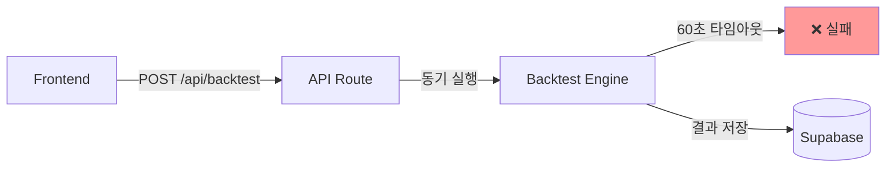
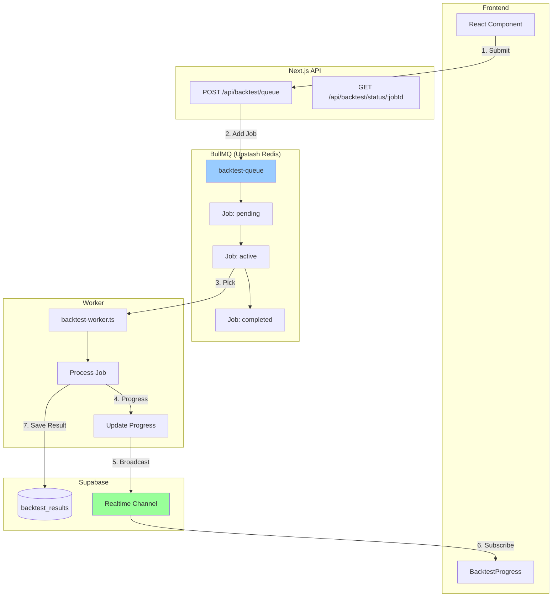

# Loop 11 Specification: 백테스트 큐 시스템
**BullMQ + Supabase Realtime 통합**

작성일: 2025-12-16
목표 완료: 2025-12-29 (2주)
담당: Backend + Frontend 풀스택
V2 9.5 → V3 9.7

---

## 🎯 목표 & 성공 지표

### 비즈니스 목표
- 동시 접속자 확장: 10명 → **100명**
- 베타 오픈 블로커 해결
- 매출 증대: **+₩677,500/월** (ROI 33배)

### 기술 목표
- 백테스트 비동기 처리 (60초 타임아웃 해결)
- 실시간 진행률 표시 (WebSocket)
- 유료 유저 우선 처리 (Priority Queue)

### 성공 지표 (KPI)
- ✅ 동시 100명 백테스트 처리 성공
- ✅ 평균 대기시간 <30초
- ✅ 진행률 업데이트 지연 <2초
- ✅ Worker 장애 시 자동 복구 <5분
- ✅ Redis 메모리 사용량 <100MB

---

## 📐 아키텍처 설계

### 현재 아키텍처 (문제점)


**문제점:**
1. 60초 타임아웃 (Vercel 제한)
2. 동시 요청 시 서버 과부하
3. 유저 이탈 (1분+ 대기)

### 목표 아키텍처 (해결책)


**해결책:**
1. Job Queue로 비동기 처리
2. Worker 프로세스 분리 (타임아웃 없음)
3. WebSocket 실시간 진행률

---

## 🗄️ 데이터 모델

### 1. BullMQ Job Schema

```typescript
// src/types/queue.ts
export interface BacktestJob {
  // Job ID는 BullMQ가 자동 생성
  userId: string;
  strategyId: string;
  backtestParams: {
    symbol: string;
    startDate: string; // ISO 8601
    endDate: string;
    initialCapital: number;
    commission: number;
    slippage: number;
  };
  priority: number; // 0 (Free) | 1 (Basic) | 2 (Pro)
  createdAt: number; // timestamp
}

export interface BacktestJobResult {
  jobId: string;
  status: 'pending' | 'active' | 'completed' | 'failed';
  progress: number; // 0-100
  result?: {
    backtestId: string;
    totalReturn: number;
    sharpeRatio: number;
    maxDrawdown: number;
    // ... 기존 backtest_results 스키마
  };
  error?: string;
  startedAt?: number;
  completedAt?: number;
}
```

### 2. Supabase 테이블 추가

```sql
-- backtest_jobs 테이블 (선택적, Redis에 있으므로 필수 아님)
CREATE TABLE backtest_jobs (
  id UUID PRIMARY KEY DEFAULT uuid_generate_v4(),
  job_id TEXT UNIQUE NOT NULL, -- BullMQ Job ID
  user_id UUID REFERENCES auth.users(id),
  strategy_id UUID REFERENCES strategies(id),
  status TEXT NOT NULL CHECK (status IN ('pending', 'active', 'completed', 'failed')),
  progress INTEGER DEFAULT 0 CHECK (progress >= 0 AND progress <= 100),
  priority INTEGER DEFAULT 0,
  created_at TIMESTAMPTZ DEFAULT NOW(),
  started_at TIMESTAMPTZ,
  completed_at TIMESTAMPTZ,
  error_message TEXT
);

CREATE INDEX idx_backtest_jobs_user ON backtest_jobs(user_id);
CREATE INDEX idx_backtest_jobs_status ON backtest_jobs(status);

-- Realtime 활성화
ALTER PUBLICATION supabase_realtime ADD TABLE backtest_jobs;
```

### 3. Realtime Channel 구조

```typescript
// Channel: backtest:progress
// Event: progress_update

interface ProgressUpdate {
  jobId: string;
  progress: number; // 0-100
  status: 'active' | 'completed' | 'failed';
  message?: string; // "데이터 로딩 중...", "백테스트 실행 중..."
  timestamp: number;
}
```

---

## 🔧 기술 스택

### 필수 패키지

```json
{
  "dependencies": {
    "bullmq": "^5.0.0",
    "ioredis": "^5.3.2",
    "@supabase/supabase-js": "^2.38.0" // 이미 설치됨
  },
  "devDependencies": {
    "@types/ioredis": "^5.0.0"
  }
}
```

### 환경 변수

```env
# .env.local
UPSTASH_REDIS_URL=redis://:password@region.upstash.io:port
UPSTASH_REDIS_TOKEN=your_token_here

# Worker용 별도 프로세스
WORKER_CONCURRENCY=5 # 동시 처리 Job 수
WORKER_MAX_RETRIES=3 # 실패 시 재시도 횟수
```

---

## 📝 API 설계

### 1. POST /api/backtest/queue
**백테스트 Job 생성**

```typescript
// Request
POST /api/backtest/queue
{
  "strategyId": "uuid",
  "params": {
    "symbol": "AAPL",
    "startDate": "2024-01-01",
    "endDate": "2024-12-31",
    "initialCapital": 100000,
    "commission": 0.001,
    "slippage": 0.0005
  }
}

// Response (200 OK)
{
  "jobId": "bull:backtest:1234567890",
  "status": "pending",
  "estimatedWaitTime": 15, // seconds
  "queuePosition": 3
}

// Error (429 Too Many Requests)
{
  "error": "RATE_LIMIT_EXCEEDED",
  "message": "You have 2 jobs in queue. Max 3 allowed for Free tier.",
  "retryAfter": 120 // seconds
}
```

**구현:**

```typescript
// src/app/api/backtest/queue/route.ts
import { NextRequest, NextResponse } from 'next/server';
import { createClient } from '@/lib/supabase/server';
import { backtestQueue } from '@/lib/queue/backtest-queue';
import { rateLimit } from '@/lib/rate-limit';

export async function POST(req: NextRequest) {
  const supabase = createClient();
  const { data: { user } } = await supabase.auth.getUser();

  if (!user) {
    return NextResponse.json({ error: 'Unauthorized' }, { status: 401 });
  }

  // Rate limiting (Upstash Redis)
  const { success, remaining } = await rateLimit(user.id, {
    limit: 10, // 10 jobs per hour
    window: 3600,
  });

  if (!success) {
    return NextResponse.json({
      error: 'RATE_LIMIT_EXCEEDED',
      message: `Rate limit exceeded. ${remaining} requests remaining.`,
    }, { status: 429 });
  }

  const body = await req.json();
  const { strategyId, params } = body;

  // User tier 확인 (priority 결정)
  const { data: profile } = await supabase
    .from('user_profiles')
    .select('tier')
    .eq('user_id', user.id)
    .single();

  const priority = profile?.tier === 'pro' ? 2 : profile?.tier === 'basic' ? 1 : 0;

  // Job 추가
  const job = await backtestQueue.add('backtest', {
    userId: user.id,
    strategyId,
    backtestParams: params,
    priority,
    createdAt: Date.now(),
  }, {
    priority, // BullMQ priority (높을수록 우선)
    removeOnComplete: 100, // 완료 후 100개까지 보관
    removeOnFail: 200,
  });

  // 대기 시간 추정
  const waitingCount = await backtestQueue.getWaitingCount();
  const estimatedWaitTime = waitingCount * 10; // 1 job당 10초 가정

  return NextResponse.json({
    jobId: job.id,
    status: 'pending',
    estimatedWaitTime,
    queuePosition: waitingCount + 1,
  });
}
```

### 2. GET /api/backtest/status/:jobId
**Job 상태 조회**

```typescript
// Request
GET /api/backtest/status/bull:backtest:1234567890

// Response (200 OK)
{
  "jobId": "bull:backtest:1234567890",
  "status": "active",
  "progress": 45,
  "message": "백테스트 실행 중... (2023-06-15)",
  "startedAt": 1734345600000,
  "estimatedCompletion": 1734345660000
}

// Response (완료 시)
{
  "jobId": "bull:backtest:1234567890",
  "status": "completed",
  "progress": 100,
  "result": {
    "backtestId": "uuid",
    "totalReturn": 0.234,
    "sharpeRatio": 1.45,
    "maxDrawdown": -0.12,
    // ...
  },
  "completedAt": 1734345700000
}
```

**구현:**

```typescript
// src/app/api/backtest/status/[jobId]/route.ts
import { NextRequest, NextResponse } from 'next/server';
import { backtestQueue } from '@/lib/queue/backtest-queue';

export async function GET(
  req: NextRequest,
  { params }: { params: { jobId: string } }
) {
  const job = await backtestQueue.getJob(params.jobId);

  if (!job) {
    return NextResponse.json({ error: 'Job not found' }, { status: 404 });
  }

  const state = await job.getState();
  const progress = job.progress as number;

  return NextResponse.json({
    jobId: job.id,
    status: state,
    progress,
    data: job.data,
    returnvalue: job.returnvalue, // 완료 시 결과
    failedReason: job.failedReason,
    processedOn: job.processedOn,
    finishedOn: job.finishedOn,
  });
}
```

### 3. DELETE /api/backtest/cancel/:jobId
**Job 취소**

```typescript
// Request
DELETE /api/backtest/cancel/bull:backtest:1234567890

// Response (200 OK)
{
  "success": true,
  "message": "Job cancelled successfully"
}
```

---

## 🔨 Worker 구현

### src/workers/backtest-worker.ts

```typescript
import { Worker, Job } from 'bullmq';
import { createClient } from '@supabase/supabase-js';
import { backtestEngine } from '@/lib/backtest/engine';
import { BacktestJob, BacktestJobResult } from '@/types/queue';

const supabase = createClient(
  process.env.NEXT_PUBLIC_SUPABASE_URL!,
  process.env.SUPABASE_SERVICE_ROLE_KEY! // Service role key 필요
);

const worker = new Worker<BacktestJob, BacktestJobResult>(
  'backtest-queue',
  async (job: Job<BacktestJob>) => {
    console.log(`[Worker] Processing job ${job.id}...`);

    const { userId, strategyId, backtestParams } = job.data;

    try {
      // 1. 진행률 업데이트: 데이터 로딩 중
      await job.updateProgress(10);
      await broadcastProgress(job.id!, 10, 'active', '데이터 로딩 중...');

      // 2. 백테스트 실행 (기존 엔진 재사용)
      const result = await backtestEngine.run({
        ...backtestParams,
        onProgress: async (progress: number, message: string) => {
          // 진행률: 10% (로딩) + 80% (실행) + 10% (저장)
          const adjustedProgress = 10 + (progress * 0.8);
          await job.updateProgress(adjustedProgress);
          await broadcastProgress(job.id!, adjustedProgress, 'active', message);
        },
      });

      // 3. 결과 저장
      await job.updateProgress(95);
      await broadcastProgress(job.id!, 95, 'active', '결과 저장 중...');

      const { data: backtest, error } = await supabase
        .from('backtest_results')
        .insert({
          user_id: userId,
          strategy_id: strategyId,
          ...result,
        })
        .select()
        .single();

      if (error) throw error;

      // 4. 완료
      await job.updateProgress(100);
      await broadcastProgress(job.id!, 100, 'completed', '완료!');

      console.log(`[Worker] Job ${job.id} completed successfully`);

      return {
        jobId: job.id!,
        status: 'completed',
        progress: 100,
        result: {
          backtestId: backtest.id,
          ...result,
        },
      };
    } catch (error) {
      console.error(`[Worker] Job ${job.id} failed:`, error);
      await broadcastProgress(
        job.id!,
        0,
        'failed',
        `오류 발생: ${(error as Error).message}`
      );
      throw error; // BullMQ가 재시도 처리
    }
  },
  {
    connection: {
      host: process.env.UPSTASH_REDIS_HOST,
      port: parseInt(process.env.UPSTASH_REDIS_PORT!),
      password: process.env.UPSTASH_REDIS_PASSWORD,
    },
    concurrency: parseInt(process.env.WORKER_CONCURRENCY || '5'),
    removeOnComplete: { count: 100 },
    removeOnFail: { count: 200 },
  }
);

// Realtime 진행률 브로드캐스트
async function broadcastProgress(
  jobId: string,
  progress: number,
  status: 'active' | 'completed' | 'failed',
  message: string
) {
  await supabase
    .from('backtest_jobs')
    .upsert({
      job_id: jobId,
      progress,
      status,
      message,
      updated_at: new Date().toISOString(),
    });
}

// Worker 이벤트 핸들러
worker.on('completed', (job) => {
  console.log(`✅ Job ${job.id} completed`);
});

worker.on('failed', (job, err) => {
  console.error(`❌ Job ${job?.id} failed:`, err.message);
});

worker.on('error', (err) => {
  console.error('Worker error:', err);
});

console.log('🚀 Backtest worker started');
```

### Worker 실행 스크립트

```json
// package.json
{
  "scripts": {
    "worker": "tsx watch src/workers/backtest-worker.ts",
    "worker:prod": "tsx src/workers/backtest-worker.ts"
  }
}
```

---

## 🎨 Frontend 구현

### 1. 진행률 컴포넌트

```typescript
// src/components/BacktestProgress.tsx
'use client';

import { useEffect, useState } from 'react';
import { createClient } from '@/lib/supabase/client';
import { Progress } from '@/components/ui/progress';
import { RealtimeChannel } from '@supabase/supabase-js';

interface BacktestProgressProps {
  jobId: string;
  onComplete?: (result: any) => void;
}

export function BacktestProgress({ jobId, onComplete }: BacktestProgressProps) {
  const [progress, setProgress] = useState(0);
  const [status, setStatus] = useState<'pending' | 'active' | 'completed' | 'failed'>('pending');
  const [message, setMessage] = useState('대기 중...');
  const supabase = createClient();

  useEffect(() => {
    let channel: RealtimeChannel;

    const subscribe = async () => {
      // Realtime 구독
      channel = supabase
        .channel(`backtest:${jobId}`)
        .on(
          'postgres_changes',
          {
            event: '*',
            schema: 'public',
            table: 'backtest_jobs',
            filter: `job_id=eq.${jobId}`,
          },
          (payload) => {
            const { progress, status, message } = payload.new as any;
            setProgress(progress);
            setStatus(status);
            setMessage(message || '처리 중...');

            if (status === 'completed') {
              // 완료 시 결과 가져오기
              fetchResult();
            }
          }
        )
        .subscribe();

      // 초기 상태 polling (Realtime fallback)
      const pollStatus = setInterval(async () => {
        const res = await fetch(`/api/backtest/status/${jobId}`);
        const data = await res.json();

        if (data.status !== 'pending' && data.status !== 'active') {
          clearInterval(pollStatus);
        }

        setProgress(data.progress);
        setStatus(data.status);

        if (data.status === 'completed') {
          clearInterval(pollStatus);
          onComplete?.(data.result);
        }
      }, 2000); // 2초마다 폴링

      return () => {
        clearInterval(pollStatus);
      };
    };

    subscribe();

    return () => {
      channel?.unsubscribe();
    };
  }, [jobId, supabase]);

  const fetchResult = async () => {
    const res = await fetch(`/api/backtest/status/${jobId}`);
    const data = await res.json();
    if (data.status === 'completed') {
      onComplete?.(data.result);
    }
  };

  return (
    <div className="space-y-4">
      <div className="flex items-center justify-between">
        <span className="text-sm font-medium">
          {status === 'pending' && '대기 중'}
          {status === 'active' && '실행 중'}
          {status === 'completed' && '완료'}
          {status === 'failed' && '실패'}
        </span>
        <span className="text-sm text-muted-foreground">{progress}%</span>
      </div>

      <Progress value={progress} className="h-2" />

      <p className="text-xs text-muted-foreground">{message}</p>

      {status === 'failed' && (
        <div className="rounded-md bg-destructive/10 p-3">
          <p className="text-sm text-destructive">
            백테스트 실행 중 오류가 발생했습니다.
          </p>
        </div>
      )}
    </div>
  );
}
```

### 2. 백테스트 제출 플로우

```typescript
// src/app/backtest/page.tsx
'use client';

import { useState } from 'react';
import { BacktestProgress } from '@/components/BacktestProgress';

export default function BacktestPage() {
  const [jobId, setJobId] = useState<string | null>(null);
  const [result, setResult] = useState<any>(null);

  const handleSubmit = async (params: any) => {
    const res = await fetch('/api/backtest/queue', {
      method: 'POST',
      headers: { 'Content-Type': 'application/json' },
      body: JSON.stringify(params),
    });

    const data = await res.json();
    setJobId(data.jobId);
  };

  const handleComplete = (backtestResult: any) => {
    setResult(backtestResult);
    setJobId(null);
  };

  return (
    <div>
      {!jobId && !result && (
        <button onClick={() => handleSubmit({ /* params */ })}>
          백테스트 시작
        </button>
      )}

      {jobId && (
        <BacktestProgress jobId={jobId} onComplete={handleComplete} />
      )}

      {result && (
        <div>
          <h2>백테스트 결과</h2>
          <p>총 수익률: {result.totalReturn}%</p>
          <p>샤프 비율: {result.sharpeRatio}</p>
        </div>
      )}
    </div>
  );
}
```

---

## 🧪 테스트 계획

### 1. 단위 테스트

```typescript
// tests/queue/backtest-queue.test.ts
import { describe, it, expect, beforeAll, afterAll } from 'vitest';
import { backtestQueue } from '@/lib/queue/backtest-queue';

describe('Backtest Queue', () => {
  beforeAll(async () => {
    await backtestQueue.obliterate({ force: true }); // 테스트 DB 초기화
  });

  it('should add job to queue', async () => {
    const job = await backtestQueue.add('backtest', {
      userId: 'test-user',
      strategyId: 'test-strategy',
      backtestParams: {},
      priority: 1,
      createdAt: Date.now(),
    });

    expect(job.id).toBeDefined();
    expect(job.data.userId).toBe('test-user');
  });

  it('should prioritize pro users', async () => {
    const freeJob = await backtestQueue.add('backtest', { priority: 0 });
    const proJob = await backtestQueue.add('backtest', { priority: 2 });

    const jobs = await backtestQueue.getJobs(['waiting']);
    expect(jobs[0].id).toBe(proJob.id); // Pro 유저가 먼저
  });

  afterAll(async () => {
    await backtestQueue.close();
  });
});
```

### 2. 부하 테스트 (Locust)

```python
# locustfile.py
from locust import HttpUser, task, between

class BacktestUser(HttpUser):
    wait_time = between(1, 3)

    @task
    def submit_backtest(self):
        response = self.client.post("/api/backtest/queue", json={
            "strategyId": "test-strategy",
            "params": {
                "symbol": "AAPL",
                "startDate": "2024-01-01",
                "endDate": "2024-12-31",
                "initialCapital": 100000
            }
        })

        if response.status_code == 200:
            job_id = response.json()["jobId"]
            self.poll_status(job_id)

    def poll_status(self, job_id):
        while True:
            response = self.client.get(f"/api/backtest/status/{job_id}")
            status = response.json()["status"]

            if status in ["completed", "failed"]:
                break
```

**실행:**
```bash
locust -f locustfile.py --users 100 --spawn-rate 10
```

### 3. 통합 테스트

```typescript
// tests/integration/backtest-flow.test.ts
import { describe, it, expect } from 'vitest';

describe('Backtest Flow (E2E)', () => {
  it('should complete backtest end-to-end', async () => {
    // 1. Job 제출
    const submitRes = await fetch('/api/backtest/queue', {
      method: 'POST',
      body: JSON.stringify({ /* params */ }),
    });
    const { jobId } = await submitRes.json();

    // 2. 상태 폴링 (최대 60초)
    let status = 'pending';
    let attempts = 0;
    while (status !== 'completed' && attempts < 30) {
      await new Promise(resolve => setTimeout(resolve, 2000));
      const statusRes = await fetch(`/api/backtest/status/${jobId}`);
      const data = await statusRes.json();
      status = data.status;
      attempts++;
    }

    // 3. 결과 검증
    expect(status).toBe('completed');
    expect(data.result).toBeDefined();
    expect(data.result.totalReturn).toBeTypeOf('number');
  }, 60000); // 60초 타임아웃
});
```

---

## 📊 모니터링 & 운영

### 1. Redis 메모리 모니터링

```typescript
// src/lib/queue/monitor.ts
import { backtestQueue } from './backtest-queue';

export async function getQueueMetrics() {
  const [waiting, active, completed, failed] = await Promise.all([
    backtestQueue.getWaitingCount(),
    backtestQueue.getActiveCount(),
    backtestQueue.getCompletedCount(),
    backtestQueue.getFailedCount(),
  ]);

  return {
    waiting,
    active,
    completed,
    failed,
    total: waiting + active,
  };
}

// Cron job: 5분마다 Grafana로 전송
setInterval(async () => {
  const metrics = await getQueueMetrics();
  console.log('[Queue Metrics]', metrics);

  // TODO: Grafana Loki로 전송
}, 300000); // 5분
```

### 2. Worker Health Check

```typescript
// src/workers/health.ts
import { Worker } from 'bullmq';

export function setupHealthCheck(worker: Worker) {
  worker.on('error', (err) => {
    console.error('[Worker] Error:', err);
    // TODO: Sentry로 전송
  });

  worker.on('stalled', (jobId) => {
    console.warn('[Worker] Job stalled:', jobId);
    // TODO: 알림 발송
  });
}
```

### 3. Grafana 대시보드 쿼리

```promql
# 큐 대기 시간
rate(backtest_queue_waiting_count[5m])

# Worker 처리 속도
rate(backtest_queue_completed_count[5m])

# 실패율
rate(backtest_queue_failed_count[5m]) / rate(backtest_queue_total_count[5m])
```

---

## 🚨 장애 대응

### 시나리오 1: Worker 프로세스 다운
**증상**: Job이 `active` 상태에서 멈춤

**대응:**
1. Worker 재시작: `npm run worker:prod`
2. BullMQ가 자동으로 stalled job 감지 (30초 후)
3. 자동 재시도 (최대 3회)

**예방:**
- PM2로 Worker 프로세스 관리 (자동 재시작)
```bash
pm2 start npm --name "backtest-worker" -- run worker:prod
pm2 startup
pm2 save
```

### 시나리오 2: Redis 연결 끊김
**증상**: Job 추가 실패

**대응:**
1. Upstash Redis 상태 확인
2. 연결 재시도 (BullMQ 자동)
3. 30초 후에도 실패 시 유저에게 알림

**예방:**
- Connection retry 설정
```typescript
{
  connection: {
    maxRetriesPerRequest: 3,
    retryDelayOnFailover: 1000,
  }
}
```

### 시나리오 3: Supabase Realtime 지연
**증상**: 진행률 업데이트 느림 (>5초)

**대응:**
1. Polling fallback 자동 활성화 (2초 간격)
2. Supabase 상태 확인

---

## 📦 배포 체크리스트

### 환경 변수 설정
- [ ] `UPSTASH_REDIS_URL` 프로덕션 값 설정
- [ ] `SUPABASE_SERVICE_ROLE_KEY` 설정
- [ ] `WORKER_CONCURRENCY` 설정 (권장: 5)

### 데이터베이스 마이그레이션
- [ ] `backtest_jobs` 테이블 생성
- [ ] Realtime 활성화
- [ ] 인덱스 생성

### Worker 배포
- [ ] PM2 설정 완료
- [ ] Health check 엔드포인트 추가
- [ ] 로그 수집 설정 (Grafana Loki)

### 모니터링
- [ ] Grafana 대시보드 추가
- [ ] Sentry 에러 추적 설정
- [ ] 알림 채널 설정 (Slack/이메일)

### 테스트
- [ ] 부하 테스트 (100명 동시 접속)
- [ ] 장애 시나리오 테스트
- [ ] 롤백 계획 수립

---

## 📚 참고 문서

- BullMQ 공식 문서: https://docs.bullmq.io/
- Supabase Realtime: https://supabase.com/docs/guides/realtime
- Upstash Redis: https://upstash.com/docs/redis

---

**작성**: Claude Code (Sonnet 4.5)
**문서 버전**: 1.0
**최종 업데이트**: 2025-12-16
